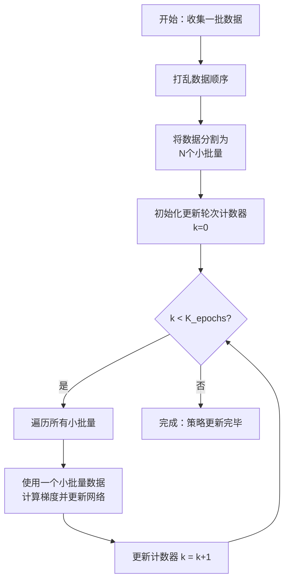

# 强化学习

# PPO

## 算法过程

### :one:初始化

PPO算法的成功实施，很大程度上依赖于**网络参数的合理初始化**和**超参数的恰当设置**。下面我将为你详细解释这两个关键环节。

#### 网络参数初始化

在PPO中，我们通常需要初始化两个核心网络：**策略网络（Actor）**和**价值网络（Critic）**。初始化方法直接影响训练的收敛速度和稳定性。

**常用初始化方法**： 
**正交初始化（Orthogonal Initialization）**：这是强化学习中**非常常见且推荐**的方法。它对权重矩阵进行正交初始化，并通常配合一个推荐的增益值（如 `std=np.sqrt(2)`）。这种方法有助于确保各层网络的输出在初始阶段尽可能不相关，从而改善梯度流动，避免特征相关性带来的问题，提升训练稳定性和效率。 
**Xavier/Glorot 初始化**：适用于使用 `tanh` 等激活函数的网络，旨在保持前向和反向传播中信号的方差。 
**Kaiming/He 初始化**：更适合使用 `ReLU` 及其变种激活函数的网络。 
**偏差（Bias）初始化**：通常初始化为一个较小的常数（如0.0）。

#### PPO超参数清单

超参数是指描述算法的参数，而参数指的是策略/价值网络里面的参数

PPO的超参数可分为几大类。以下是PPO算法中**常见且重要的大部分超参数**及其典型作用或取值范围：

| **超参数名称**                    | **符号/变量名**         | **典型取值范围或示例**                        | **作用与说明**                                               |
| :-------------------------------- | :---------------------- | :-------------------------------------------- | :----------------------------------------------------------- |
| **折扣因子**                      | `gamma` (`γ`)           | 0.9, **0.99**, 0.999                          | 衡量未来奖励的当前价值。值越大，智能体越“有远见”。           |
| **裁剪范围**                      | `clip_range` (`ϵ`)      | **0.1**, 0.2                                  | 限制新旧策略概率比的变动范围，防止策略更新步幅过大，是PPO稳定性的核心。 |
| **广义优势估计(GAE)参数**         | `gae_lambda` (`λ`)      | **0.9**, 0.95, 0.97                           | 在估计优势函数时平衡偏差和方差。λ=1时几乎只看长期收益，λ=0时则退化为单步TD误差。 |
| **每个批次数据的训练轮数**        | `(K_)epochs`            | **3**, 4, 5, 10                               | 对同一批采集到的数据，进行多少次梯度更新。有助于提高数据利用效率，但设置过高可能导致过拟合。 |
| **Rollout长度（每更新周期步数）** | `n_steps`               | 2048, **1024**                                | 每次策略更新前，需要用当前策略与环境交互收集多少步的数据。   |
| **批次大小 (Mini-batch Size)**    | `batch_size`            | 32, **64**, 128, 256                          | 从`n_steps`收集的数据中，每次更新时采样的小批量数据大小。较大的批次通常训练更稳定，但需要更多内存。 |
| **学习率 (Learning Rate)**        | `lr_actor`, `lr_critic` | Actor: **3e-4**, 1e-4; Critic: **3e-4**, 1e-3 | 控制策略网络（Actor）和价值网络（Critic）参数更新的步长。Critic的学习率有时可以略高于Actor。 |
| **熵奖励系数**                    | `ent_coef`              | 0.0, **0.01**, 0.001                          | 在损失函数中添加策略熵的系数（正数）。**鼓励探索**，防止策略过早收敛到局部最优。值越大，探索性越强。 |
| **价值函数损失系数**              | `vf_coef`               | **0.5**, 1.0                                  | 价值函数损失在总损失中的权重。用于平衡策略优化和价值函数拟合的重要性。 |
| **最大梯度范数**                  | `max_grad_norm`         | **0.5**, 1.0                                  | 梯度裁剪的阈值。防止训练过程中梯度爆炸，提升稳定性。         |
| **总训练时间步**                  | `total_timesteps`       | 1e6, 1e7, ...                                 | 整个训练过程预计与环境交互的总步数。                         |
| **优化器**                        | `optimizer`             | **Adam**, AdamW                               | 用于更新网络参数的优化算法。Adam及其变种因其自适应学习率特性而被广泛使用。 |
| **激活函数**                      | `activation_fn`         | **`tanh`**, `relu`, `leaky_relu`              | 神经网络中使用的非线性激活函数。`tanh`在连续控制任务中很常见。 |
| **网络结构**                      | `network_arch`          | `[64, 64]`, `[256, 256]`                      | 策略网络和价值网络隐藏层的尺寸。例如`[64, 64]`表示两个隐藏层，每层64个神经元。 |

#### 💡 超参数设置提示

- **没有万能配置**：这些典型值是一个**起点**，最优设置**强烈依赖于具体任务**（如环境特性、奖励稀疏性、观测和动作空间维度等）。
- **调参是必要过程**：通常需要**网格搜索（Grid Search）**、**随机搜索（Random Search）** 或使用更高级的**贝叶斯优化（Bayesian Optimization）** 方法来寻找最适合你任务的那组超参数。
- **稳定优先**：PPO的优势在于其稳定性。如果训练出现剧烈震荡或性能崩溃，可以尝试**减小学习率、缩小裁剪范围或降低GAE的λ值**。
- **探索与利用的平衡**：通过**熵系数**可以调节探索强度。训练初期可适当调高以鼓励探索，后期可逐渐降低以利于策略收敛。

#### 💎 总结

总而言之，PPO算法的网络初始化（如**正交初始化**）和超参数设置（如**裁剪范围ϵ、折扣因子γ、学习率**等）共同构成了算法稳定高效运行的基础。理解每个超参数的作用，并从经验值开始进行针对性的调优，是成功应用PPO解决实际问题的关键一步。


### :two:数据收集/`Rollout`

使用当前的策略网络和环境进行交互，采集一系列轨迹数据。每条**轨迹**包含==状态$s_t$、动作$a_t$、奖励$r_t$和下一个状态$s_{t+1}$==。这些数据被存储起来，用于后续的更新步骤。

#### 📊 数据收集步骤详解

数据收集的核心目标是：使用当前的策略（旧策略）与环境进行交互，生成一系列的经验轨迹（Trajectories），为后续的优势估计和策略更新提供数据基础。

其具体流程和关键概念可以通过下表快速概览：

| 核心环节     | 涉及的关键概念                                               | 说明与解释                                                   |
| :----------- | :----------------------------------------------------------- | :----------------------------------------------------------- |
| **交互循环** | **状态 (State, $s_t$)**   **动作 (Action, $a_t$)**   **奖励 (Reward, $r_t$)**   **终止信号 (Done)** | 智能体感知环境状态，策略网络输出动作概率并采样，环境返回奖励和新状态，直到回合结束或达到步数限制。 |
| **数据存储** | **轨迹 (Trajectory)**   **经验回放池 (Replay Buffer)**       | 将交互产生的序列数据按时间顺序存储。PPO通常使用On-Policy缓冲区，更新后即丢弃。 |
| **策略使用** | **行为策略 (Behavior Policy)**                               | 在数据收集阶段，与环境交互的策略是固定的旧策略 $π_{θ_{old}}$，**其参数在此阶段不被更新**。 |
| **数据内容** | **状态序列**   **动作序列**   **奖励序列**   **下一状态序列**   **旧策略的动作概率** | 每条轨迹包含这些完整信息，用于后续计算回报、优势函数和概率比。 |

------

#### 🔍 关键概念深入解释

1. **状态（State, $s_t$)**: **定义**: 环境在时刻 t 的完整描述，是智能体做出决策的依据。 **示例**: 在游戏中可以是屏幕像素；在无人机控制中可以是位置、速度、姿态等传感器数据；在棋类游戏中可以是棋盘布局。
2. **动作（Action, $a_t$)**: **定义**: 智能体在状态 $s_t$ 下根据当前策略（旧策略）选择执行的操作。 **生成方式**: 策略网络（Actor）接收状态 $s_t$，输出一个动作的概率分布 $π_{θ_{old}}(a∣s_t)$，智能体**依此概率进行采样**（而非总是选择概率最高的动作），从而获得动作$a_t$。这种采样是**探索（Exploration）** 的关键。
3. **奖励（Reward, $r_t$)**: **定义**: 环境在智能体执行动作 $a_t$ 后提供的即时反馈信号。**奖励函数的设计是引导智能体学习目标的核心**。 **示例**: 无人机到达目标点给予正奖励，撞墙给予负奖励；游戏中得分、击败敌人获得正奖励。
4. **终止信号（Done）**: **定义**: 一个**布尔**标志，表示当前回合（Episode）是否结束。 
   **结束条件**: 通常可能是任务成功、任务失败（如无人机坠毁）、或达到最大步数限制以防止无限循环。
5. **轨迹（Trajectory）**: **定义**: 从初始状态到回合结束的一个完整状态-动作-奖励序列，记为 $τ=(s_0,a_0,r_0,s_1,a_1,r_1,...,s_T)$。 
   **重要性**: PPO算法通常是以整个轨迹或一批轨迹为单位进行计算和更新的。
6. **On-Policy (同策略) 数据收集**: **定义**: PPO是一种**On-Policy**算法，这意味着用于更新策略的数据**必须**由当前最新版本的策略（尽管在收集阶段固定为旧策略）收集而来。
    **与Off-Policy的区别**: 像DQN这样的Off-Policy算法可以使用经验回放池存储的历史数据（来自过去不同版本的策略）来更新当前策略。
   而PPO在每次策略更新后，**会丢弃旧数据**，必须用更新后的新策略重新交互收集数据。这是因为PPO依赖的重要性采样比率在策略变化过大时会失效。

#### ⚠️ 注意事项与最佳实践

- **保持时序**: 收集到的数据必须**严格保持时间顺序**，因为后续计算回报（Return）和优势（Advantage）需要依赖未来的奖励信息，打乱顺序会导致计算错误。
- **批量收集**: 不会只收集一条轨迹就进行更新。通常会收集**多条轨迹**（例如多个episodes）或达到一个**预定步数**（如2048步）的数据，形成一个批次（Batch），然后利用整个批次的数据进行多次小批量（Mini-batch）更新，这有助于提高数据利用效率和训练稳定性。
- **探索与利用的平衡**: 在数据收集阶段，策略网络输出的是概率分布并通过采样选择动作，这本身就提供了探索。此外，PPO的目标函数中通常还包含**熵正则化（Entropy Regularization）**项，它会直接鼓励策略保持随机性，增加探索，防止过早收敛于局部最优解。

#### 💎 总结

数据收集这一步看似只是“执行-记录”的循环，但却是PPO算法稳定性和有效性的根基。它确保了用于评估和更新策略的数据与当前策略紧密相关（On-Policy），同时通过概率采样和熵奖励为智能体提供了必要的探索能力，使其能够不断发现可能更优的行为策略。

简单来说，这一步就是在**认真积累“经验”**，而这些经验将是智能体学习和改进的“教材”。


### :three:计算优势函数与回报

利用收集到的数据，计算每个时间步的优势估计（Advantage Estimate, $A_t$）和回报（Return, $R_t$​）。

#### 广义优势估计（GAE） 


广义优势估计（GAE）是一种在强化学习（如PPO算法）中用于估计优势函数的关键技术，它通过引入参数λ对多步时序差分（TD）误差进行指数加权平均，从而在蒙特卡洛方法（低偏差高方差）和单步TD方法（高偏差低方差）之间实现偏差与方差的平衡，λ越接近0越偏向单步TD估计，λ越接近1越接近蒙特卡洛估计，最终为策略梯度更新提供更稳定且高效的优势信号。

广义优势估计（Generalized Advantage Estimation, GAE）是强化学习中一种**用于估计优势函数** A(st,at)的技术，它通过**平衡估计过程中的偏差（Bias）和方差（Variance）**，为策略优化（如PPO算法）提供稳定且高效的更新信号。

| 特性/方法      | 蒙特卡洛 (MC) 方法        | 时序差分 (TD) 方法             | 广义优势估计 (GAE)                       |
| -------------- | ------------------------- | ------------------------------ | ---------------------------------------- |
| **核心思想**   | 使用完整轨迹的实际回报    | 使用单步奖励与下一状态价值估计 | 使用多步TD误差的指数加权平均             |
| **偏差**       | **低偏差** (依赖实际回报) | **高偏差** (依赖价值函数估计)  | **通过λ调节** (λ→1, 低偏差；λ→0, 高偏差) |
| **方差**       | **高方差** (回报随机性大) | **低方差** (仅一步随机性)      | **通过λ调节** (λ→1, 高方差；λ→0, 低方差) |
| **数据效率**   | 低 (需等待回合结束)       | 高 (可在线更新)                | 中 (需一定轨迹长度)                      |
| **计算复杂度** | 低                        | 低                             | 中                                       |
| **适用场景**   | 回合制任务                | 在线学习、连续任务             | 需平衡偏差与方差的策略优化               |

#### 🔍 1. 什么是偏差和方差？

在强化学习的价值估计中：

- **偏差 (Bias)**：指**估计值的期望**与**真实价值**之间的系统性误差。**高偏差**意味着估计方法可能一直**偏离真实值**（例如，由于依赖不准确的价值函数预测），导致学习方向错误，模型可能无法学到最优解（欠拟合）。
- **方差 (Variance)**：指**估计值自身**的波动或离散程度。**高方差**意味着估计值对使用的**具体数据样本非常敏感**（例如，不同轨迹的累积回报差异巨大），导致训练过程不稳定、震荡剧烈，难以收敛（过拟合）。

在优势估计的语境下：

- **偏差**高：意味着对动作优势的判断**可能系统性地偏离其真实优势**，从而误导策略更新。
- **方差**高：意味着优势值**在不同批次数据间波动很大**，导致策略更新方向不一致，训练不稳定。

理想的估计方法需要在偏差和方差之间取得平衡。

#### 📊 2. 蒙特卡洛与时序差分方法的权衡

GAE的出现是为了解决传统优势估计方法的固有缺陷：

- **蒙特卡洛方法**：使用从当前时刻到回合结束的**实际折扣回报** $G_t=∑_{k=0}^∞γ^kr_{t+k}$减去状态价值估计 $V(s_t)$来计算优势，即 $A_t=G_t−V(s_t)$。 
  **优点**：**低偏差**，因为它基于实际获得的奖励。
  **缺点**：**高方差**，因为一条轨迹的最终回报受未来大量随机动作和状态转移的影响，随机性大。
- **时序差分方法**：使用**单步TD误差** $δ_t=r_t+γV(s_{t+1})−V(s_t)$直接作为优势估计，即 $A_t=δ_t$。 
  **优点**：**低方差**，因为只涉及一步的随机性。 
  **缺点**：**高偏差**，因为它严重依赖价值函数 V的准确性，如果 V估计不准，优势估计也会不准。

#### 🧮 3. GAE的工作原理与λ的作用

GAE的核心思想是：**将不同步长的TD误差进行指数加权平均**，融合多步信息，而非只依赖一步或完全依赖全程。

其计算公式为：$A_t^{GAE}=∑_{l=0}^∞(γλ)^lδ_{t+l}$

其中：

- $δ_{t+l}=r_{t+l}+γV(s_{t+l+1})−V(s_{t+l})$是第 $t+l$步的TD误差。
- γ是折扣因子，衡量未来奖励的当前价值。
- λ是**GAE的核心超参数**，取值范围为 [0,1]，用于**控制偏差和方差的权衡**。

**λ如何平衡偏差与方差？**

- **当 λ=0**：$A_t^{GAE}=δ_t$。GAE退化为**单步TD估计**，此时**方差最低**，但**偏差最高**。
- **当 λ=1**：$A_t^{GAE}=∑_{l=0}^∞γ^lδ_{t+l}=G_t−V(s_t)$。GAE等价于**蒙特卡洛估计**，此时**偏差最低**，但**方差最高**。
- **当 λ取中间值（如0.95）**：算法会以指数衰减的形式**综合考虑多步TD信息**，离当前步越近的TD误差权重越高。这在偏差和方差之间取得了出色的**平衡**。λ越接近1，越偏向蒙特卡洛的低偏差特性；越接近0，越偏向TD的低方差特性。

#### ⚙️ 4. 为什么GAE更有效？

GAE通过其设计，能更有效地估计动作的相对优势：

1. **更全面的信用分配**：通过融合多步信息，GAE能比单步TD更好地理解**动作的长期后果**，从而更准确地判断一个动作的真正价值，而不仅仅是即时奖励。
2. **更稳定的估计信号**：通过引入λ参数和加权平均，GAE**平滑了单步TD误差的波动**，并**降低了蒙特卡洛回报的随机噪声**，提供了一个**方差相对较低且偏差可控**的优势估计。这使得策略梯度更新的方向更加一致和可靠。
3. **更清晰的策略更新指导**：一个由GA计算出的、偏差和方差平衡的优势值 At，能更可靠地指示动作的相对好坏： 若 At>0，可信地表明动作 at优于平均水平，应增加其概率。 若 At<0，可信地表明动作 at劣于平均水平，应减少其概率。 这种高质量的反馈是PPO等算法稳定训练的关键。

#### 💎 总结

总而言之，**广义优势估计（GAE）** 是一种巧妙的技术，它通过一个参数 λ在**高偏差低方差**的时序差分估计和**低偏差高方差**的蒙特卡洛估计之间找到了一个平滑的过渡地带。它提供了一种**偏差和方差平衡**的优势估计方法，从而能够**更有效、更稳定地**评估当前动作相对于平均水平的优势，进而驱动策略更可靠地优化。这正是GAE成为PPO等现代强化学习算法核心组件的原因。

- 回报（$R_t$）是从当前状态到 episode 结束的累积折扣奖励，体现了长期收益


### :four:策略更新（优化目标函数）

- **价值函数损失**：同时，价值网络（Critic）通过最小化其预测值（$Vφ(s)$）与实际回报（$R_t$）之间的均方误差（MSE）来更新：

   $L^{VF} = L^{VF}=Loss^{Value Function} = MSE\left(V_{\phi}(s_t), R_t\right) = \frac{1}{N} \sum_{i=1}^{N} \left(V_{\phi}\left(s_t^{(i)}\right) - R_t^{(i)}\right)^2$
   ==$V_ϕ(s_t)$==是Critic网络基于状态 $s_t$，遵循当前策略，所能获得的预期未来总回报的估计值。它是对未来收益的一个"预测"或"评估"。

   ==$R_t$==也常称为**目标回报（Target Return）** 或 **折扣回报（Discounted Return）**。它是通过智能体与环境交互实际得到的奖励，经过折扣计算后得到的总和，计算公式通常为 $R_t=r_t+γr_{t+1}+γ^2r_{t+2}+⋯$，其中 γ是折扣因子，用于平衡即时奖励和未来奖励的重要性

   **均方误差（MSE, Mean Squared Error）**：一种常用的损失函数，**计算预测值与真实值之间差异的平方的平均值**。MSE对较大的误差给予更大的惩罚，这有助于模型更关注于减少较大的预测偏差。
   **优势函数（Advantage Function, At**），$ A_t=R_t−V_ϕ(s_t)$

   N是批次中的样本数量


好的，PPO（Proximal Policy Optimization，近端策略优化）的第四步是**策略更新（Policy Update）**。这是整个算法的核心，它利用前几步收集的数据和计算的结果，来实际优化智能体的策略（即模型参数），使其朝着获得更高回报的方向改进，同时严格限制更新的幅度以保证稳定性。

为了让您清晰理解这个复杂的过程，我将它分解为几个关键环节，并解释其中涉及的核心概念。

#### 🔧 1. 核心输入：策略比率与优势函数

在更新开始前，我们已经拥有了两个关键输入：

- **策略比率 (Probability Ratio, $r_t(θ)$)**: 
  **定义**：$r_t(θ)=\dfrac{π_{θ_{old}}(a_t∣s_t)}{π_θ(a_t∣s_t)}$。其中 $π_{θ_{old}}$是**旧策略**（即数据收集阶段使用的策略），$π_θ$是**当前待更新的新策略**。 
  **含义**：这个比率衡量了**新策略相对于旧策略，选择某个动作的倾向性发生了多大变化**。 
  $r_t(θ)>1$：新策略比旧策略**更倾向于**选择动作 $a_t$。 
  $r_t(θ)=1$：新旧策略选择该动作的概率**相同**。 
  $r_t(θ)<1$：新策略比旧策略**更不倾向于**选择动作 $a_t$。
  $π_θ(a_t∣s_t)$代表策略网络采取某个动作的具体概率
- **优势函数估计 (Advantage Estimate, $\hat{A_t}$)**: 
  **定义**：$\hat{A_t}=Q(s_t,a_t)−V(s_t)$，通常由广义优势估计（GAE）计算得出。 
  **含义**：它衡量了在状态 $s_t$下，执行动作 $a_t$相比遵循当前策略的平均表现**要好多少（或差多少）**。
  $\hat{A_t}>0$：该动作**优于**平均水平，应被鼓励。 
  $\hat{A_t}<0$：该动作**劣于**平均水平，应被抑制。

#### 🎯 2. PPO 的核心创新：裁剪目标函数

PPO 通过一个精心设计的目标函数来实现“近端”优化，其核心思想是：**在鼓励提升策略性能的同时，严格限制每次更新的步长，防止新策略相对旧策略偏离太远**。

其目标函数（用于最大化）为：

$L^{CLIP}(θ)=\hat{\mathbb{E}}_t[min(r_t(θ)\hat{A_t},clip(r_t(θ),1−ϵ,1+ϵ)\hat{A_t})]$

这个公式是PPO的精华所在，它通过一个 `min`操作和 `clip`操作来实现其目标：

- **$r_t(θ)A_t$(未裁剪项)**：这是策略梯度的基础形式。其作用是： 当 A^t>0(好动作)，算法会尝试**增大** $r_t(θ)$（即增加该动作的概率）。 当 $\hat{A_t}<0$(坏动作)，算法会尝试**减小** $r_t(θ)$（即减少该动作的概率）。
- **$clip(r_t(θ),1−ϵ,1+ϵ)\hat{A_t}$(裁剪项)**：`clip`函数将策略比率 rt(θ)限制在区间 [1−ϵ,1+ϵ]内。ϵ是一个超参数，通常设为 0.1 或 0.2，它定义了**信任域（Trust Region）** 的边界，即允许新策略偏离旧策略的最大范围。
- **$min(⋅)$操作**：这是确保更新稳定性的关键。算法最终会采用**未裁剪项**和**裁剪项**中**较小**的那个值。 **当未裁剪项和裁剪项符号一致时**：`min`操作会有效地将策略比率 rt(θ)的**有效范围限制在** [1−ϵ,1+ϵ]之内，从而防止单次更新幅度过大。 **当符号不一致时（通常发生在策略想朝反方向更新时）**：`min`操作会阻止这种有害的更新。

**直观理解**：这个目标函数就像给策略更新加上了一个“保险丝”。它允许你根据优势函数的指导来调整策略，但一旦你试图调整得“太猛”（比率超出预定范围），这个“保险丝”就会熔断，强制你只能进行小幅度的、安全的调整。这有效防止了策略性能的崩溃式下降。

#### ⚖️ 3. 总损失函数：策略、价值与探索的平衡

在实践中，为了同时优化策略网络（Actor）和价值网络（Critic），并鼓励一定程度的探索，PPO的总损失函数通常包含三部分：

$L^{TOTAL}(θ)=L^{CLIP}(θ)+c_1L^{VF}(θ)−c_2S[π_θ](s_t)$

- **$L^{CLIP}(θ)$(策略损失)**：如上所述，是PPO的核心，负责优化策略以最大化期望回报。
- **$L^{VF}(θ)$(价值函数损失)**： 
  **定义**：通常是均方误差（MSE），$L^{VF}=\frac1{N}∑(V_θ(s_t)−R_t)^2$。其中 Rt是实际回报（如蒙特卡洛回报或TD(λ)回报），Vθ(st)是Critic网络对状态价值的预测。
  **作用**：训练价值网络（Critic）更准确地预测状态的价值，从而为下一次优势函数的计算提供更可靠的基线（Baseline）。这使得优势估计 A^t的方差更低，引导策略更新的信号更稳定。
- **$S[π_θ](s_t)$(熵奖励)**： **定义**：策略熵，$S[π_θ](s_t)=−∑_aπ_θ(a∣s_t)logπ_θ(a∣s_t)$。它衡量了策略的随机性或不确定性。 
  **作用**：**鼓励探索**。熵值越大，说明策略越随机，越倾向于尝试不同的动作。在损失函数中**减去**熵项（即加上负熵），意味着**最大化熵**，从而防止策略过早地收敛到一个局部最优的确定性策略，帮助智能体发现可能更具潜力的行为。
- **$c1, c2$(系数)**：是超参数，用于平衡这三部分损失在总损失中的权重。

#### 📊 4. 更新流程与迭代优化

有了总损失函数，策略更新的具体步骤如下：

1. **计算梯度**：计算总损失 $L^{TOTAL}$关于策略参数 $θ$的梯度。
2. **梯度下降/上升**：使用优化器（如Adam）**沿着梯度方向（最大化）或反方向（最小化损失）** 更新策略网络（Actor）和价值网络（Critic）的参数。
3. **迭代更新**：**对同一批采集到的数据，进行多次（K_epochs）小批量（Mini-batch）更新**。这种做法大大提高了数据的利用效率。
4. **更新旧策略**：在完成对当前批次数据的多次更新后，**用更新后的策略参数覆盖旧策略的参数**（θold←θ）。然后算法回到第一步，使用新的策略重新收集数据，开始新一轮的循环。

#### 💡 总结与核心思想

PPO的第四步——策略更新，是整个算法的“大脑”。它巧妙地运用了**裁剪机制（Clipping）** 来约束策略更新的幅度，在一个**信任域（Trust Region）** 内进行优化，从而在**追求更高性能**和**保持训练稳定性**之间取得了完美的平衡。

其核心逻辑是一个闭环：

1. **收集数据**（用旧策略与环境交互）。
2. **评估表现**（计算优势函数，判断动作好坏）。
3. **谨慎更新**（利用裁剪目标函数，小幅调整策略参数）。
4. **迭代循环**（用新策略替换旧策略，重复过程）。

这种“小步快跑”的方式，使得PPO成为强化学习中最强大、最稳定的算法之一，尤其适用于像训练大语言模型这样复杂且昂贵的任务。


## 一些概念

### 时间步Timestep

**是什么**：在强化学习的上下文中，**时间步**是智能体与环境交互的一个**离散时间单位**。它代表了算法运行中的一个基本步骤或迭代

**在流程中的角色**：智能体在时间步 $t$ 观察状态 $s_t$，执行动作 $a_t$，环境返回奖励 $r_t$并转移到下一个状态 $s_{t+1}$。这个过程不断重复，形成一条轨迹（Trajectory）。PPO的每次数据收集（Rollout）就是由成千上万个这样的时间步组成的。

**为什么是基本的**：所有后续的计算（奖励、回报、价值估计）都是基于时间步这个基本单位进行的。


### 优化策略

优化策略的方法主要分为两大类：

**基于价值的方法 (Value-Based)**：算法（如Q-Learning、DQN）先学习评估每个动作的价值（Q值），然后策略直接选择价值最高的动作（通常是确定性策略）

**基于策略的方法 (Policy-Based)**：算法（如REINFORCE、PPO）直接学习和优化策略函数 πθ(a∣s)本身的参数 θ。这是我们讨论的PPO所采用的方法。它通过计算策略梯度来更新参数，使得能够带来更高回报的动作在未来被选择的概率增加，反之则减少


### 状态价值函数$V(s)$

```
在当前状态S下，智能体一直采用策略网络Actor来做决策，每一个时间步的预计回报的加权平均（越远的时间步的预计回报权重越低），就是状态价值函数V(s)的含义
```

状态价值函数 $V^π(s)$ 表示：在状态$ s$ 下，智能体遵循策略$ π$ 后所能获得的期望累积回报（从当前状态开始的累积奖励）。其贝尔曼方程（Bellman Equation）的表达式为：

$V^\pi(s) = \sum_{a} \pi(a \mid s) \sum_{s', r} p(s', r \mid s, a) \left[ r + \gamma V^\pi(s') \right]$

**公式解读：**

- $∑_aπ(a∣s)$: 对当前状态 $ s$ 下所有可能的动作 $ a$ 进行加权平均，权重是策略 $ π$ 选择动作 $ a$ 的概率$ π(a∣s) $。这体现了策略的“平均行为”。
- $ \sum_{s', r} p(s', r \mid s, a)$ : 对执行动作 $ a$ 后可能转移到的下一个状态$ s′$ 和获得的即时奖励 r，按环境的动态特性 $p(s′,r∣s,a)$（即状态转移概率和奖励函数）进行加权求和。这体现了环境的不确定性。
- $r + \gamma V^\pi(s')$: 即时奖励 $r$ 加上下一状态 $ s′$ 的折扣价值 $γV^π(s′)$。其中 $γ$ (折扣因子, $0 ≤ γ ≤ 1$) 表示未来奖励的当前价值，用于平衡即时奖励和长期回报 。
- **整体含义**: $V^π(s)$ 是策略 $ π$ 下状态 $ s$ 的期望长期回报，计算分两步：按策略选择动作的平均（外层求和）以及按环境动态转移状态的平均（内层求和）。

**V函数回答的问题是**：“在状态 s 下，如果我遵循当前策略 π，平均能获得多少回报？”


### 动作价值函数$Q(s,a)$

```
在当前状态s下，先采取动作a，之后一直采用策略网络Actor来做决策，每一个时间步的预计回报的加权平均（越远的时间步的预计回报权重越低），就是状态价值函数V(s)的含义
```

**动作价值函数** Qπ(s,a) 表示在**状态 s 下采取动作 a，之后遵循策略 π 所能获得的期望累积回报**。其**贝尔曼方程**的表达式为：

$Q^\pi(s, a) = \sum_{s', r} p(s', r \mid s, a) \left[ r + \gamma \sum_{a'} \pi(a' \mid s') Q^\pi(s', a') \right]$

**公式解读：**

- **$∑_{s′,r}p(s^′,r∣s,a)$**: 对执行动作 a 后可能转移到的**下一个状态 s′** 和获得的**即时奖励 r**，按环境的动态特性 p(s′,r∣s,a) 进行加权求和。这同样体现了**环境的不确定性**。
- **$r+γ∑_{a^′}π(a^′∣s^′)Q^π(s^′,a^′)$**: **即时奖励 r** 加上**下一状态 s′ 的长期折扣价值**。其中 ∑a′π(a′∣s′)Qπ(s′,a′) 实际上是下一状态 s′ 的**状态价值函数 Vπ(s′)**，即 Vπ(s′)=∑a′π(a′∣s′)Qπ(s′,a′) 。
- **关键区别**: ==与V函数不同，Q函数**显式固定了第一步的动作 a**，而后续的动作选择仍由策略 π 决定== 。
- **整体含义**: Qπ(s,a) 表示在状态 s 执行动作 a 后，继续遵循策略 π 的期望长期回报 。

**Q函数回答的问题是**：“在状态 s 下，如果我执行动作 a 后继续遵循策略 π，平均能获得多少回报？”


### Q函数与V函数的关系&核心区别总结

两者通过以下公式紧密关联：

$V^π(s)=∑_aπ(a∣s)Q^π(s,a)$

即，**状态值函数 Vπ(s) 是状态-动作值函数 Qπ(s,a) 在动作空间上的加权平均**，权重由策略 π 决定。

在**最优策略 π∗** 下，两者也满足关系：

$$ V^{*}(s)=\max _{a}Q^{*}(s,a) $$

即，**最优状态价值等于该状态下所有可能动作中最优动作价值的最大值**。

为了更直观地理解，下表汇总了Q函数和V函数的核心区别：

| **维度**         | **状态价值函数 V(s)**                     | **动作价值函数 Q(s, a)**                          |
| :--------------- | :---------------------------------------- | :------------------------------------------------ |
| **评价对象**     | 状态 s 本身的长期价值                     | 在状态 s 下执行动作 a 的长期价值                  |
| **动作显式依赖** | 无（隐含在策略中）                        | 有（显式包含动作 a）                              |
| **策略依赖**     | 必须依赖策略 π                            | 必须依赖策略 π                                    |
| **贝尔曼方程**   | Vπ(s)=∑aπ(a∥s)∑s′,rp(s′,r∥s,a)[r+γVπ(s′)] | Qπ(s,a)=∑s′,rp(s′,r∥s,a)[r+γ∑a′π(a′∥s′)Qπ(s′,a′)] |
| **应用场景**     | 评估策略优劣（如策略迭代）                | 优化动作选择（如Q-Learning、SARSA）               |
| **表格表示**     | 大小为 ∥S∥ 的一维表                       | 大小为 ∥S∥×∥A∥ 的二维表                           |

希望这些公式和解释能帮助你更精确地理解Q函数和V函数。它们是理解许多强化学习算法（如Q-Learning、SARSA、策略梯度等）的基础。


### 优势函数

优势函数（Advantage Function）是强化学习中一个非常巧妙且实用的工具，它就像一个**“动作评分师”**，专门告诉你**在某个状态下，选择一个特定动作比遵循当前策略的平均表现要好多少或差多少**。

优势函数通常用字母 A(s,a) 表示，它的定义非常简单直观：

$A(s,a)=Q(s,a)−V(s)$

这里：

- **Q(s,a)（动作价值函数）**：代表了在状态 s 下，选择动作 a 之后，按照既定策略所能获得的**预期总回报**。它评估的是**某个具体动作**的长期价值。
- **V(s)（状态价值函数）**：代表了在状态 s 下，遵循当前策略所能获得的**平均预期总回报**。它评估的是**某个状态本身**的长期价值，综合考虑了所有可能采取的动作。

所以，**优势函数 A(s,a) 衡量的就是在状态 s 下，动作 a 的价值相对于该状态下平均价值的偏差**。

根据 A(s,a) 的数值，我们可以立刻判断一个动作的相对优劣：

| 优势函数值 | 含义                                                         |
| :--------- | :----------------------------------------------------------- |
| A(s,a)>0   | **正面优势**：意味着在状态 s 下选择动作 a **优于**平均表现。这个动作应该被鼓励和更多采用。 |
| A(s,a)=0   | **中性**：意味着动作 a 的表现**刚好等于**平均水平。          |
| A(s,a)<0   | **负面优势**：意味着在状态 s 下选择动作 a **不如**平均表现。这个动作应该被避免或减少选择。 |

你可能会问，既然已经有 Q(s,a) 告诉我们每个动作的绝对价值了，为什么还需要优势函数呢？主要原因在于：

1. **降低方差，稳定训练**：直接使用 Q(s,a) 或回报 Rt 作为更新策略的信号可能波动很大（方差高），因为它们包含了所有未来的奖励，这些奖励的随机性很强。而 V(s) 作为基线 (Baseline)，锚定了平均表现水平。用 Q(s,a) 减去这个基线，相当于去除了所有动作都面临的共同“运气”成分，只保留了这个动作**独有的相对优势**，使得指导信号更稳定，训练过程更平滑。
2. **更清晰的策略更新方向**：它明确指出了哪些动作是“好”的（应增加其概率），哪些是“坏”的（应减少其概率）。策略梯度（Policy Gradient）方法通过引入优势函数，可以更有效地更新策略，即增加优势为正的动作的概率，降低优势为负的动作的概率。


#### 一个简单的例子：自动驾驶决策

想象一个强化学习模型在学开车，当前状态 s 是**前方十字路口，绿灯亮起**。

- **动作 a **：主要有“加速通过”、“匀速通过”、“刹车减速”。
- **V(s)（状态价值）**：模型评估在“绿灯亮的路口”这个状态下，按照它当前的驾驶策略，平均能获得多少回报（比如安全、快速地通过）。
- **Q(s,a)（动作价值）**： `Q(绿灯, 加速)`：评估选择“加速”能获得多少回报。 `Q(绿灯, 匀速)`：评估选择“匀速”能获得多少回报。 `Q(绿灯, 刹车)`：评估选择“刹车”能获得多少回报。

现在，计算优势函数：

- **`A(绿灯, 加速) = Q(加速) - V(绿灯)`** 如果结果是**正数**，说明在绿灯时加速比它平时的平均表现要好（也许因为此时车流少，加速能更快通过，回报更高）。模型会学习更倾向于在类似情况下加速。
- **`A(绿灯, 刹车) = Q(刹车) - V(绿灯)`** 如果结果是**负数**，说明在绿灯时无故刹车比平均表现差（可能导致后车追尾或通行效率低下，回报较低）。模型会学习减少在绿灯时无故刹车的概率。


## 一些问题

理解损失函数及其相关概念是掌握现代机器学习，特别是强化学习（如PPO算法）的关键。下面我将为您系统地解析这些概念。

### 📉 核心概念：损失函数

**损失函数**是衡量机器学习模型预测结果与真实值之间差异的数学工具。您可以把它想象成一个“计分器”或“教练”，它不断告诉模型：“你的预测离正确答案还有多远。”

- **为什么要计算损失函数？** 模型的学习过程本质上是一个不断自我优化的过程。损失函数为这个优化过程提供了**明确的目标和方向**。如果没有损失函数，模型就像在黑暗中摸索，不知道如何调整内部参数才能提高预测准确性。通过计算损失值，模型获得了反馈，从而知道该往哪个方向改进。
- **损失函数的作用是什么？** **量化误差**：将预测的好坏转化为一个具体的数字，使得模型的性能可以被衡量和比较。 **指导优化**：损失函数是优化算法（如梯度下降）的**目标函数**。模型通过计算损失函数对自身参数的梯度（导数），并沿着减小损失的方向更新参数，从而逐步提升性能。 **评估模型状态**：在训练过程中，观察损失值的变化可以帮助我们判断模型是否正在有效学习（损失下降）、是否已经收敛（损失稳定）或是否出现了过拟合（训练损失下降但验证损失上升）等问题。

在强化学习中，损失函数的设计更为复杂，因为它需要引导智能体学习如何做出最优决策。接下来，我们看几个强化学习中的核心概念。

### 🧠 强化学习中的关键回报估计

在评估一个动作或一个状态的好坏时，我们需要估计未来的累积回报，主要有两种经典方法：

| 概念             | 定义                                                         | 特点与用途                                                   |
| ---------------- | ------------------------------------------------------------ | ------------------------------------------------------------ |
| **蒙特卡洛回报** | 使用从当前时刻到回合结束所获得的**实际累积奖励**作为回报估计。公式为 Rt=∑k=0Tγkrt+k，其中 T是回合结束的时间步。 | **优点**：无偏，因为它基于真实的奖励序列。 **缺点**：方差高，且必须等到一个回合结束后才能计算，学习速度慢。适用于回合制任务。 |
| **TD(λ)回报**    | 时序差分回报，是蒙特卡洛思想和自举（Bootstrapping）的折中。它结合了从当前时刻开始往后**若干步的真实奖励**，以及对后续状态的**价值估计**。TD(λ)是其一种通用的平滑版本，通过参数 λ权衡近期奖励和远期估计的权重。 | **优点**：无需等待回合结束，可以每步更新，学习更快；通过调整 λ可以在偏差和方差之间取得平衡。 |

为了更高效、更稳定地估计回报，现代强化学习算法（如PPO）常采用**广义优势估计（GAE）**，它正是在 TD(λ)的基础上发展而来的，能更好地平衡偏差和方差。

### ⚖️ 价值函数损失与均方误差

在Actor-Critic框架（如PPO）中，**Critic（评价者）** 的角色就是学习一个**价值函数 V(s)**，用于预测从状态 s开始，遵循当前策略所能获得的期望累积回报（即估计某个状态有多“好”）。

- **价值函数损失**：衡量Critic网络的预测值 V(s)与**真实回报**（目标值，如前面提到的蒙特卡洛回报或TD回报 Rt）之间的差异。训练Critic的目标就是最小化这个损失，让它的预测越来越准。
- **均方误差**：这是**价值函数损失**最常采用的具体形式，属于回归问题中常用的损失函数。其计算公式为： `MSE=n1i=1∑n(V(si)−Ri)2`其中 V(si)是Critic对状态 si的预测值，Ri是计算出的回报目标值（例如通过GAE计算出的回报 Rt^），n是样本数量。这个公式计算的是预测值与目标值之间差值的平方的平均值，能够放大大的误差，让优化过程更关注于修正明显的错误。

在PPO中，价值函数损失（通常采用MSE）是总损失函数的一个重要组成部分，它与策略损失（Actor部分）共同作用，引导智能体学习。

希望这份详细的解释能帮助您清晰地理解这些核心概念！如果您对其中任何一个点感兴趣，我们可以进行更深入的探讨。


理解PPO算法的这些核心组件，确实能帮你更清晰地把握其运作全貌。下面我们逐一拆解。

### 🔍 价值函数损失与熵奖励

在PPO的总体损失函数 LTOTAL(θ)=LCLIP(θ)+c1LVF(θ)−c2S[πθ](st)中，价值函数损失和熵奖励是两项关键的组成部分。

| 组成部分                               | 表达式                           | 含义与作用                                                   |
| -------------------------------------- | -------------------------------- | ------------------------------------------------------------ |
| **价值函数损失 (Value Function Loss)** | LVF(ϕ)=21(Vϕ(st)−Rt^)2           | 衡量 Critic 网络预测的状态价值 Vϕ(st)与实际回报估计 Rt^（如通过GAE计算）之间的差距，通常采用均方误差 (MSE)。其目标是让 Critic 的价值估计更准确，从而为 Actor 的策略更新提供稳定可靠的指导（例如计算优势函数）。 |
| **熵奖励 (Entropy Bonus)**             | S[πθ](st)=−∑aπθ(a∣st)logπθ(a∣st) | 表示策略 πθ在状态 st下的**信息熵**。熵值越高，表示策略的动作概率分布越均匀（随机性大，探索性强）；熵值越低，表示策略越倾向于某个特定动作（确定性高，利用性强）。在损失函数中**减去**熵项（即加上负熵），是为了**鼓励探索**，防止策略过早收敛到局部最优解而停止尝试其他可能更优的动作。 |

系数 c1和 c2是超参数，用于平衡策略更新、价值函数拟合和探索三者之间的重要性。

### ⚙️ 优化器与 Adam

- **优化器 (Optimizer)**：在深度学习中，优化器是一种**算法**，其核心任务是**根据损失函数计算出的梯度（导数），来更新神经网络的参数（权重和偏置），以最小化损失函数**。你可以把它想象成在复杂地形上寻找最低点的向导，它决定了下山的**方向**和**步长**。
- **Adam (Adaptive Moment Estimation)**：Adam 是一种**非常常用且高效的优化器**。它结合了**动量法（Momentum）** 和 **RMSProp** 两种优化器的思想。 **动量**：类似于小球下山具有惯性，Adam 会考虑过去梯度的指数加权平均（一阶矩估计），使得参数更新方向更加稳定，有助于加速收敛并抑制震荡。 **自适应学习率**：Adam 还会计算梯度平方的指数加权平均（二阶矩估计），为每个参数自动调整（适应）不同的学习率。这意味着对于频繁更新的参数，会给予较小的学习率；对于不常更新的参数，会给予较大的学习率。这使得 Adam 在实践中对超参数（如初始学习率）相对不敏感，且通常能表现出良好的收敛性能。

在PPO中，我们通常使用 Adam 优化器来最小化上述的总损失函数 LTOTAL，从而同时更新策略网络（Actor）和价值网络（Critic）的参数。

### 🔄 迭代更新的具体过程

PPO采用了一种**小批量、多轮次**的数据利用方式，具体过程如下表所示：

| 步骤                               | 关键操作                                                     | 说明                                                         |
| ---------------------------------- | ------------------------------------------------------------ | ------------------------------------------------------------ |
| **1. 数据收集**                    | 使用**当前旧策略** πθold与环境交互，收集大量轨迹数据，并存入缓冲区。 | 在这一阶段，策略参数是固定的。收集的数据包括状态、动作、奖励、下一状态等。 |
| **2. 优势估计**                    | 利用收集到的数据（如通过GAE方法）计算每个时间步的优势估计值 At^和回报估计 Rt^。 | 此步骤为后续的策略更新和价值函数更新提供目标信号。           |
| **3. 迭代优化 (循环 K_epochs 次)** | **3.1 打乱数据**：将缓冲区中的整个数据集随机打乱顺序。       | 打乱数据是为了确保每次小批量采样都是随机的，有助于减少训练偏差，使模型学习更稳定。 |
|                                    | **3.2 小批量更新**：将打乱后的数据分成若干个小批量（Mini-batches）。**对于每一个小批量数据**： a. **前向传播**：将小批量中的状态 st分别输入策略网络（Actor）和价值网络（Critic），得到当前策略的动作概率分布 πθ(at∥st)和状态价值估计 Vϕ(st)。 b. **计算损失**：利用该小批量数据计算总损失 LTOTAL(θ,ϕ)，这包括基于新老策略概率比的策略损失 LCLIP、价值函数损失 LVF和熵奖励项。 c. **反向传播与参数更新**：计算总损失关于参数 θ(Actor) 和 ϕ(Critic) 的梯度，然后使用优化器（如Adam）**同时更新**策略网络和价值网络的参数。 | 这是PPO实现**高样本效率**的关键。通过**多次（K_epochs）** 遍历并使用**同一批**收集到的数据，充分挖掘了数据价值，避免了一次交互仅一次更新的浪费。 |
| **4. 策略同步**                    | 完成 K_epochs 轮优化后，将旧策略的参数更新为当前优化后的新策略参数：θold←θ。 | 至此，一个完整的PPO更新回合结束。接下来会清空或覆盖缓冲区，用新的策略重新收集数据，开始下一个回合。 |

### 💎 核心价值

这种“**收集一批数据，然后对其进行多次小批量随机梯度更新**”的机制，是PPO在样本效率和训练稳定性之间取得优异平衡的关键设计之一。它既避免了传统策略梯度方法一次交互仅一次更新的低效，又通过裁剪等机制保证了多次更新不会使策略偏离太远。

希望这次的解释能帮助你更深入地理解PPO算法的内部运作机制。


### 对于K_epochs 轮优化

您的理解**基本正确**，但有一个非常关键的细节需要澄清，这个细节正是PPO算法高效和稳定的核心所在。

简单来说，PPO的“小批量多次更新”指的是：**将同一批收集到的数据，随机打乱后，分成多个小批量（Mini-batches），然后对这同一批数据，进行多轮（K_epochs）的迭代更新。**

为了更清晰地展示这个过程，并与您的理解进行对比，我制作了下面的流程图和说明。

#### 🔄 PPO迭代更新流程详解



上图展示了PPO迭代更新的完整流程。关键在于，**“多轮（K_epochs）”和“小批量（Mini-batch）”是两个不同维度的概念**。

- **您的理解**：“对这一轮收集到的数据，分成n份，然后进行n次迭代。” 这描述了**一轮（1个Epoch）** 内的操作：将数据分份，然后遍历更新一次。
- **完整的流程**：如流程图所示，PPO会将上述“遍历更新一次”的过程**重复进行K_epochs轮**。在每一轮开始前，通常还会将数据重新打乱，以提升学习效果。

#### 💡 核心概念澄清

让我们通过一个具体的例子来理解表格中的关键参数：

| 概念                    | 定义                                                         | 在例子中的角色                             |
| ----------------------- | ------------------------------------------------------------ | ------------------------------------------ |
| **一批数据 (Batch)**    | 一次策略与环境交互收集到的所有经验数据，比如 **2048条** (s, a, r, s') 记录。 | 待学习的“总教材”。                         |
| **小批量 (Mini-batch)** | 将“一批数据”**随机分割**成的更小的子集，例如 **64条** 数据为一组。 | 每次上课专注学习的“一小节内容”。           |
| **更新轮数 (K_epochs)** | 对**同一批完整数据**进行完整学习/更新的**次数**，例如 **10次**。 | 把“总教材”**反复学习多遍**，比如复习10遍。 |

**举个例子：**

假设我们设置：

- 收集一批数据的大小为 **2048** 条经验。
- 小批量大小为 **64**。
- 更新轮数 `K_epochs = 10`。

那么，一次完整的PPO更新过程如下：

1. **数据收集**：用当前策略与环境交互，收集到2048条经验。
2. **迭代更新**： 将2048条数据随机打乱。 将这2048条数据分割成 2048 / 64 = **32个小批量**。 进行第1轮更新：依次使用这32个小批量数据，更新32次网络参数。 完成第1轮后，重新打乱数据（可选，但常见），再进行第2轮更新（又更新32次）... 如此重复，直到完成 **10轮** 更新。总共更新了 10 * 32 = **320次**。

#### 🎯 为什么要这样设计？

这种“**一批数据，多轮学习**”的设计有两个核心优势：

1. **极高的样本效率**：在现实世界或复杂模拟器中，与环境交互获取数据通常是耗时且昂贵的。PPO通过多次复用同一批数据，极大地减少了所需的环境交互次数，用更少的数据完成更有效的学习。
2. **稳定且充分的优化**：策略网络的优化（梯度下降）是一个迭代过程。只对一批数据更新一次可能不够“充分”，学习可能不彻底。进行多轮更新，允许优化器对同一批数据蕴含的信息进行更深入的挖掘，从而得到更优的策略参数。同时，PPO的裁剪机制确保了即使在多轮更新后，新策略也不会偏离旧策略太远，保证了稳定性。

#### 💎 总结

所以，您的理解只对了一半。更精确的说法是：

**PPO的迭代更新是“多轮”和“小批量”的结合。它把一轮收集的数据分成多个小批量，然后不是只更新一轮，而是用这同一批数据反复更新多轮，从而在保证稳定性的前提下，极大地提高了数据利用效率。**

希望这个解释能彻底澄清您的疑问！


# MDP马尔科夫决策过程


# Q-Learning


