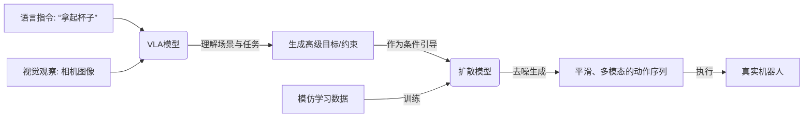

# 机器人行业规划

## BOSS指向

### 运动控制算法

岗位职责：
1、开展机器人运动模仿学习化学习算法的研究和开发，并开展仿真和实物上部署、测试等工作；
2. 开展算法相关的数据处理、模型训练、测试和推理等任务；
3. 持续追踪机器人运动模仿学习化学习等领域前沿和最新的相关技术发展，具备快速复现算法效果的能力；
4. 协助团队人员完成整机集成系统测试与应用。
岗位要求：
【专业】机器人、自动化、机电、计算机等相关专业，研究生学历
【知识】了解机器人运动规划/控制基础理论和经典方法，掌握深度学习化学习方面的方法和技术
【能力】精通至少一种编程语言，包括但不限于Java、Python、C/C++等
【经验】有机器人运动学习技术研究经验优先；有实际机器人测试验证经验者优先；在相关国际会议、知名期刊上发表论文者优先；有机器人竞赛经验者优先
【特质】具备优秀的学习能力，具备团队合作精神，能够与他人有效地合作，共同完成任务和解决问题
来源：BOSS直聘
链接：https://www.zhipin.com/web/geek/jobs?city=101010100&jobType=1901&degree=204&query=%E6%9C%BA%E5%99%A8%E4%BA%BA

### 机器人AI算法工程师

1. 负责研发具身智能操作算法，研发基于VLA、强化学习等AI技术在机器人操作场景中的应用；
2. 设计网络架构，分析实验数据，评估算法表现，提升机器人在精准操作、长程任务、动态响应等关键领域的表现性能；
3. 负责将VLA模型在跨机器人本体和环境进行真机部署，评估模型在真机的性能指标；
4. 持续跟进最新的具身操作方向研究工作动态，引入最前沿的方法持续提升模型表现性能" "1. 硕士及以上学历，计算机科学、人工智能、自动化、机器人技术等相关专业；
2. 熟悉深度学习框架（例如pytorch、TensorFlow），具备大规模VLA模型的算法开发经验，具备数据处理、模型架构设计、大规模训练等经验；
3. 具备机器学习算法在机器人领域的开发经验，包括并不限于reinforcement learning、imitation learning、transfer learning、action-conditioned world models、representation learning、dexterous manipulation、sim-to-real transfer、vision language models、motion planning等；
4. 具备机器人真机经验（例如Aloha、Franka、Fetch等），具备良好的编程能力，熟悉Python或C++编程语言，熟悉主流机器人软件框架例如ROS，熟悉主流的仿真软件例如IsaacLab、IsaacGym、Mujoco、Bullet、Gazebo等；
5. 具备良好的科研能力，在顶会或期刊发表过文章的优先，例如机器学习方向（NeurIPS、ICML、ICLR），机器人方向（RSS、CoRL、ICRA、IROS）、计算机视觉方向（CVPR、ICCV、ECCV）等"
来源：BOSS直聘
链接：https://www.zhipin.com/web/geek/jobs?city=101010100&jobType=1901&degree=204&query=%E6%9C%BA%E5%99%A8%E4%BA%BA

岗位职责
设计并实现基于VLA（Vision-Language-Action）架构的端到端模型，融合视觉、语言、运动控制等多模态输入，输出机器人可执行动作序列。
构建具身智能体在物理环境中的自适应决策机制，实现任务导向的交互能力。
机器人数据体系建设
主导机器人多模态数据采集方案设计（包括视觉、力控、位姿、场景语义等），开发自动化数据标注与增强工具。
构建面向具身智能训练的高质量仿真-实机联合数据集，解决数据稀缺性与泛化性问题。
模型训练与优化
开发分布式训练框架，针对大规模多模态机器人数据优化VLA模型训练效率，探索模型压缩、知识蒸馏等技术。
结合强化学习（RL） 与模仿学习（IL） 优化动作策略，提升模型在动态环境中的鲁棒性。
实时推理与部署
设计低延迟推理引擎，实现大模型在嵌入式机器人硬件（如GPU/Jetson）的高效部署，优化内存与计算资源占用。
开发在线学习框架，支持机器人在执行过程中的持续模型迭代。
仿真与实机验证
基于Isaac Gym、MuJoCo等搭建高拟真机器人训练仿真环境，加速算法迭代。
主导算法在实体机器人平台（机械臂/移动机器人等）的测试与性能调优，确保技术落地。

任职要求
本科及以上学历，计算机科学、机器人学、人工智能、自动化等相关领域。
3年以上机器人学习/具身智能/大模型研发经验，具备完整项目落地经验。
精通端到端多模态模型架构：熟悉VLA、GATO等具身智能模型，有Transformer、Diffusion等架构开发经验。
机器人数据闭环能力：设计过机器人数据采集系统，熟悉ROS/ROS2及传感器数据处理。
熟悉仿真工具（Isaac Sim, Gazebo, CARLA）与物理引擎（PyBullet, MuJoCo）；
具备大模型（LLM/VLM）微调、Prompt Engineering、Agent框架开发经验。
来源：BOSS直聘
链接：https://www.zhipin.com/web/geek/jobs?city=101010100&query=%E6%9C%BA%E5%99%A8%E4%BA%BA

### 【机器人算法工程师】

岗位职责：
机械臂算法工程师
1、复现开源的双臂机器人扩散大模型RDT，并完成数据采集、模型训练、优化等功能；
2、设计触觉反馈传感器，并用于灵巧手，实习灵巧手的触觉反馈；
3、参与机器人架构设计、零部件选型、算法方案设计；
来源：BOSS直聘
链接：https://www.zhipin.com/web/geek/jobs?city=101020100&experience=102&degree=204&query=%E6%9C%BA%E5%99%A8%E4%BA%BA

【岗位二】导航算法工程师
职位描述：
1、负责机器人基于LIDAR的导航与定位算法研究与实现，并支持机器人业务中导航的需求；
2、负责单线和多线LIDAR的开发，SLAM算法、多传感器融合算法、3D点云、3D场景重建等
3、负责无地图导航算法研究、自主实时建图方案研究；
4、实现高精度的地图更新；
岗位职责：
1、负责机器人基于LIDAR的导航与定位算法研究与实现，并支持机器人业务中导航的需求；
2、负责单线和多线LIDAR的开发，SLAM算法、多传感器融合算法、3D点云、3D场景重建等
3、负责无地图导航算法研究、自主实时建图方案研究；
4、实现高精度的地图更新；
任职要求：
1、具备3年以上导航算法研究经验，并在机器人场景、自动驾驶场景商业落地；
2、具备机器视觉算法相关经验，尤其是3D场景重建；

来源：BOSS直聘
链接：https://www.zhipin.com/web/geek/jobs?city=101020100&experience=102&degree=204&query=%E6%9C%BA%E5%99%A8%E4%BA%BA

工作职责
-负责百度自动驾驶汽车预测决策规划系统的研发、调试和测试工作
-设计核心驾驶场景处理策略,完成相关算法研发和效果验证
-与自动驾驶汽车其他各模块的工程师协同完成系统集成和调试工作
任职资格
-熟悉常见路径规划算法(例如A*、D*、RRT等 )或熟悉常用机器学习深度学习算法
-具备较好编程能力，熟练掌握C++，有较大型系统开发经验 
-较好的沟通表达能力和团队合作意识 
具有以下条件者优先: 
-熟悉如MDP、POMDP、Game Theory等轨迹预测算法 
-有常用机器学习深度学习工具使用经验及实际项目经验 
-有ROS环境下开发经验，有机器人领域相关研发及竞赛经验 
-熟练掌握CarSim、CarMaker等汽车仿真软件使用方法 
-有强数学理论基础和背景
来源：BOSS直聘
链接：https://www.zhipin.com/web/geek/jobs?city=101020100&experience=102&degree=204&query=%E6%9C%BA%E5%99%A8%E4%BA%BA

## VLA

### VLA/VLM大模型算法专家(A244036)

职位描述：
岗位职责：
1、负责自动驾驶、机器人领域VLA算法研发。

岗位要求：
1、熟悉机器人模仿学习、强化学习理论，有相关领域paper或实际落地经验；
2、有VLA（Vision Language Action Model）、VLM、LLM模型训练的实际经验，熟悉DeepSpeed、FSDP、PyTorch等深度学习框架；
3、具有大语言模型、多模态大模型、生成式模型（diffusion policy）、世界模型等算法背景；
4、在端到端自动驾驶方面有工作经验，熟悉运动/轨迹预测相关算法；
5、有自动驾驶、机器人领域AI算法经验优先。
来源：BOSS直聘
链接：https://www.zhipin.com/web/geek/jobs?city=100010000&query=VLA

### VLM/VLA 大模型算法工程师/专家

岗位职责：
- 负责多模态大模型（VLM: Vision-Language Model / VLA: Vision-Language-Action Model）在人形机器人中的算法设计与开发，将VLM/VLA 应用于人形机器人的智能操作与人机交互任务；
- 参与大模型的预训练、后训练（SFT + RL）及部署工作，支持机器人在复杂环境下的感知与行为能力；
- 与机器人平台团队、硬件团队紧密协作，实现模型在实际机器人系统中的高效运行；
- 跟踪前沿研究，推动新技术在产品中的落地应用。

任职要求：
- 计算机、人工智能、自动化等相关专业硕士及以上学历；
- 具备扎实的深度学习基础，熟悉 Transformer、BERT、ViT、CLIP、BLIP 等主流视觉-语言模型架构；
- 有大模型（VLM、LLM）训练/推理优化经验，熟悉其在多模态任务中的应用；
- 有 VLA 建模、生成式模型（如diffusion）、多模态强化学习相关项目背景；
- 熟练使用 PyTorch、TensorFlow 等深度学习框架，具备良好的工程能力和代码实现能力；
- 良好的团队协作与沟通能力，具备快速学习和解决问题的能力。

加分项：
- 熟悉机器人感知与控制领域，理解人形机器人操作、导航、交互、动作轨迹预测等基本任务流程；
- 有参与实际机器人系统或多模态交互系统开发的项目经验；
- 熟悉开源大模型生态（如 LLaVA, Pi0, RT-2, OpenVLA 等）并有实际使用或改进经验；
- 具备从零构建多模态系统或算法平台的能力。
来源：BOSS直聘
链接：https://www.zhipin.com/web/geek/jobs?city=100010000&query=VLA

### 具身智能VLA算法工程师

岗位职责： 
1. 负责机器人领域世界模型和VLA模型的训练和部署； 
2. 跟踪具身智能领域的最新研究动态和技术趋势。 
任职要求： 
1. 电子/计算机/人工智能/自动化等相关专业，硕士以上学历； 
2. 熟练掌握Python、Pytorch框架，有多机多卡训练的项目经验（DeepSpeed、FSDP等）； 
3. 具有世界模型、视频生成模型、4D生成模型训练经验者优先； 
4. 熟悉主流的VLA模型架构，如RDT、PI0等，有扩散模型、流匹配的调参经验者优先； 
5. 具有其他多模态大模型训练经验者优先，如CLIP、LLaVa、Flamingo、VILA等； 
6. 具有针对第一视角人类操作数据或开源机器人数据集（如OXE等）的后处理和训练经验者优先。
来源：BOSS直聘
链接：https://www.zhipin.com/web/geek/jobs?city=100010000&query=VLA

### VLM/VLA大模型算法工程师

职位描述

探索具身智能领域前沿多模态大模型算法，掌握最新技术趋势
构建具身智能领域多模态大模型基座VLM模型，优化数据处理、预训练、微调、RLHF等算法
推进多模态大模型在具身领域的应用落地，构建通用机器人

职位要求

计算机视觉、多模态大模型等相关领域的硕士或博士
熟悉多模态领域算法，熟悉Llava、QwenVL等基础VLM模型
对模仿学习/diffusion policy/OpenVLA/pi0等VLA模型有了解
一作顶会/顶刊论文发表，包括不仅限于ICML，ICLR，NeurIPS，ACL, EMNLP，CVPR，ECCV，ICCV等
有实际机器人项目经验者优先
来源：BOSS直聘
链接：https://www.zhipin.com/web/geek/jobs?city=100010000&query=VLA

### 具身智能VLA算法实习生

岗位职责：
1. 参与基于大算力芯片的视觉语言模型（VLA）算法研究，探索其在机器人场景中的应用（如指令理解、场景描述生成）。
2. 开发并优化多模态（视觉-语言-动作）模型，结合芯片特性实现模型轻量化部署与加速推理。
3. 构建仿真环境（如MuJoCo、Isaac Sim）中的数据集，支持VLA模型的训练与评估。
4. 协助完成从仿真到真实机器人（Sim2Real）的算法迁移与验证。
5. 撰写技术文档，参与团队内部算法复现与创新讨论。
职位要求：
1. 硕士及以上学历在读，计算机、人工智能、自动化等相关专业。
2. 熟悉Python/C++，掌握PyTorch/TensorFlow等深度学习框架。
3. 熟悉Transformer、Diffusion Model等架构，并能应用于图像处理、生成建模或时间序列建模。
4. 有大模型（LLM）或芯片加速经验者优先（如模型量化、编译器优化）。
实习要求：
每周至少工作4天，连续实习6个月以上。
对具身智能领域有热情，具备快速学习能力与团队协作精神。
加分项：
熟悉机器人仿真环境（MuJoCo、PyBullet、Isaac Sim）及ROS框架。
熟悉强化学习（RL）或Sim2Real技术。
有开源项目贡献或顶会论文（ICRA/IROS/CoRL）经验。
有实际机器人开发经验（如机械臂、移动底盘）。
来源：BOSS直聘
链接：https://www.zhipin.com/web/geek/jobs?city=100010000&query=VLA

### 大模型算法工程师-VLM/VLA

岗位职责:
1.负责自动驾驶、机器人领域VLA算法研发
岗位要求:
1.熟悉机器人模仿学习、强化学习理论，有相关领域paper或实际落地经验;
2.有VLA(Vision Language Action Model)、VLM、LLM模型训练的实际经验，熟悉DeepSpeed、FSDPPvTorch等深度学习框架;
3.具有大语言模型、多模态大模型、生成式模型(diffusion policy)、世界模型等算法背景;
4.在端到端自动驾驶方面有工作经验，熟悉运动/轨迹预测相关算法;
5.有自动驾驶、机器人领域AI算法经验优先。
来源：BOSS直聘
链接：https://www.zhipin.com/web/geek/jobs?city=100010000&query=VLA

### 具身智能多模态大模型算法工程师  VLA/V

岗位职责：
1. 研究应用大模型实现四足、人形机器人的复杂认知能力，包括：交互、场景理解、长程任务规划、行为决策推理与动作规划等；
2. 实现跨模态（视/听/触/文）的理解能力和对齐；
3. 设计构建模型训练数据集和标注方法，支持大批量自动化的标注构建
4. 负责基模型的领域预训练，模型微调SFT、强化学习（RLHF）训练，提升夸任务的泛化性能，开发高效的模型评测方法提高迭代效率，
5. 解决模型评测/部署/真机测试中的问题，满足项目交付指标要求
6. 跟踪前沿技术方案，持续迭代升级方案

岗位要求
1. 人工智能、计算机、机器人、自动驾驶、自然语言处理等相关专业硕士或博士学位
2. 熟练掌握主流大模型技术（Bert、GPT、Llama、transformer等），有VLM模型（Llava、QwenVL等）、VLA（action token）模型应用经验，熟悉CLIP、ViT、DINO、SAM等, 熟悉生成式AI 技术（diffusion）。
3. 掌握主流的具身大模型技术（RT2, π系列、OpenVLA，ACT, Diffusion Policy）
4. 熟悉大模型轻量化技术（剪枝、蒸馏、量化等）
5. 熟练掌握大模型微调方法（LoRA/P-tuning等）、RL方法（PPO/DPO/GRPO、A3C等）；
6. 具备多模态数据融合（文+视+听）研发经验；
7. 掌握大模型的分布式训练框架
8. 熟练使用PyTorch/TensorFlow深度学习框架，熟练使用Python/C++语言编程，有实际项目开发经验
9. 有 ROS2/DDS下的开发经验，能够在Linux环境下独立进行开发和调试；
来源：BOSS直聘
链接：https://www.zhipin.com/web/geek/jobs?city=100010000&query=VLA

### 高德-VLA/具身智能基座模型研究-

职位描述
空间智能是下一代人工智能的核心能力，旨在构建物理世界的数字孪生体并实现智能体在复杂环境中的自主交互。高德视觉技术中心依托阿里生态海量多模态数据，致力于打造行业领先的“空间智能基座模型”（Spatial Intelligence Foundation Model）

寻找在具身智能VLA（视觉-语言-动作）、空间计算（重建、SLAM等）及强化学习领域有深厚积累的算法同学，加入高德地图视觉技术中心。你将参与构建下一代地图中的感知、理解与决策系统，推动具身导航、AR/VR、场景建模等前沿技术的研发与落地。

1. 负责视觉语言动作（VLA）的具身智能模型和视觉语言模型（VLM）的研发，提升具身agent的空间理解和行动决策能力。 
2. 推进空间计算相关技术（如SLAM、三维重建、点云处理、姿态估计等）在下一代地图、虚拟现实等场景的应用。 
3. 探索强化学习在多模态大模型的后训练中的应用，提升具身/空间智能的能力天花板。
4. 跟踪国际前沿技术发展，持续推动技术创新，并落实到实际应用中。
职位要求
1. 具备扎实的算法和编程基础，熟练使用至少一种深度学习框架。
2. 在计算机视觉、自然语言处理、机器人感知或强化学习等领域有研究或项目经验。
3. 对新技术充满好奇心，具备高度的自驱力和韧性，较强的协同能力。
4. 在顶级会议（CVPR、ICCV、ECCV、NeurIPS、ICML、ICLR、IROS、RSS、CoRL等）发表过论文者优先。
工作地点
北京
来源：BOSS直聘
链接：https://www.zhipin.com/web/geek/jobs?city=100010000&query=VLA

### 机器人VLA算法专家/工程师

岗位职责:
1.适用于多自由度机器人多模态大模型和扩散模型算法研究与开发；
2.通过仿真环境验证算法能力，实现效果；
3.在真实环境中实现与评估，确保算法能够在实际环境中运行；

任职要求:
1.3年以上工作经验，熟悉强化学习和模仿学习，包括ACT，diffusion policy或者vla模型；
2.具备ACT、MT-ACT、RDT-1B、Pi-Zero、OpenVLA等算法相关研究背景经验者优先；
3.熟悉Nvidia Isaac Lab/Sim机器人仿真平台；
来源：BOSS直聘
链接：https://www.zhipin.com/web/geek/jobs?city=100010000&query=VLA

### vla算法专家（北京丨苏州丨深圳）

VLA 模型创新与研发：
主导机器人视觉 - 语言 - 动作（VLA）大模型的架构设计与算法研发，突破多模态特征对齐、动作序列生成等关键技术，提升模型在复杂任务中的端到端执行能力。
多模态智能系统构建：
设计融合视觉、语言与动作信号的联合训练框架，研发跨模态交互与理解机制，增强模型在动态环境下的语义理解、推理和决策能力。

任职要求
专业背景：计算机视觉、机器人学、自然语言处理等相关专业学历，专注于多模态大模型、具身智能或机器人决策控制研究。
技术能力：
熟练掌握 PyTorch/TensorFlow 框架，精通 VLA 模型（如 RT-2、OpenVLA 等）的改进与部署，熟悉强化学习、模仿学习技术。
熟悉多模态对齐技术（CLIP、DINOv2 等），具备视觉语言模型与动作生成模块的联合调优经验。
掌握机器人操作系统（ROS/ROS2），有机器人感知 - 决策 - 控制全链路开发经验者优先。
经验要求：
拥有 5 年以上多模态算法研发经验，主导过 VLA 相关项目（如自动驾驶、机械臂操作等）并实现商业化落地。
在 NeurIPS/ICML/CoRL 等顶级会议发表 VLA 相关论文，或持有具身智能领域核心专利。
来源：BOSS直聘
链接：https://www.zhipin.com/web/geek/jobs?city=100010000&query=VLA

### 蚂蚁集团-算法专家（VLA方向）

发布职位：岗位职责：
1、跟踪前沿技术进展，负责机器人大模型(VLA)和数字孪生技术能力建设；
2、负责具身智能人形机器人方向技术路线制定、技术方案设计与评审、业务应用落地；
3、指导并培养算法工程师团队，提升算法团队技术能力；

任职要求：
1、人工智能、模式识别或计算机专业的硕士或者博士；
2、数学基础扎实，熟悉概率统计和机器学习相关的理论体系；
3、具备较为广泛的深度神经网络设计、调参和优化经验，掌握垂域大模型调优最佳实践；
4、对VLA所涉及的主流算法有深入理解和实际项目经验；
5、具备大模型Post Training算法方案和数据构造经验；
6、熟悉机器人训练仿真环境软件，具有从仿真环境到物理环境迁移项目经验；
7、出色的统筹协调能力与个人影响力，具备前瞻技术视野及大局观；
8、在顶级学术会议期刊发表过相关论文者优先考虑。
来源：BOSS直聘
链接：https://www.zhipin.com/web/geek/jobs?city=100010000&query=VLA

## deepseek总结VLA/VLM

好的，这是对以上所有 **VLA/VLM 及具身智能大模型算法岗位** 的简要总结。这些岗位代表了当前机器人领域最前沿的研究方向，旨在构建能**理解语言、感知视觉并直接输出动作**的“通才”机器人模型。

---

### **核心岗位方向：VLA/VLM 具身智能算法专家**

这类岗位的核心目标是研发 **VLA (Vision-Language-Action)** 模型，这是一种能够直接将视觉和语言指令映射为机器人控制动作（Action）的多模态大模型，是实现“具身智能”的关键技术。

### **一、核心技术能力要求**

1.  **深厚的大模型技术根基**
    *   **模型架构：** 必须精通 **Transformer**, **BERT**, **GPT**, **ViT**, **CLIP** 等基础架构。深刻理解 **VLM (Vision-Language Model)** 如 **LLaVA**, **Qwen-VL** 和 **VLA** 模型如 **RT-2**, **Pi0 (PiZero)**, **OpenVLA**, **ACT**, **Diffusion Policy** 的原理与实现。
    *   **模型训练：** 拥有从**预训练 (Pre-training)**、**有监督微调 (SFT)** 到**基于人类反馈的强化学习 (RLHF/DPO)** 的全流程经验。熟悉 **LoRA**, **P-Tuning** 等参数高效微调方法。
    *   **工程实现：** 熟练使用 **PyTorch**，并具备**大规模分布式训练**的经验，熟悉 **DeepSpeed**, **FSDP** 等加速和优化工具。

2.  **多模态与生成式AI的融合能力**
    *   **多模态融合：** 精通视觉、语言、动作（有时还包括听觉、触觉）等多模态信息的对齐（Alignment）与联合训练。
    *   **生成模型：** 许多岗位要求熟悉 **Diffusion Model (扩散模型)**，因其在生成动作序列（Diffusion Policy）和世界模型中的应用。

3.  **强烈的机器人领域背景**
    *   **具身智能理念：** 理解算法如何应用于真实物理世界中的机器人，而不仅仅是处理数据。核心是 **“感知-推理-行动”** 的闭环。
    *   **机器人知识：** 了解机器人学基本概念（运动学、动力学）、**模仿学习 (Imitation Learning)**、**强化学习 (RL)** 以及 **Sim2Real** 技术流程。
    *   **开发环境：** 熟悉 **ROS/ROS2** 和至少一种机器人仿真器（**Isaac Sim**, **MuJoCo**, **PyBullet**）是重要的加分项。

### **二、典型工作内容**

1.  **算法研发：** 设计并训练下一代 VLA 模型，提升其在复杂任务中的理解和执行能力。
2.  **数据构建：** 构建和处理大规模、高质量的多模态数据集（如人类演示数据）。
3.  **训练优化：** 进行大规模分布式训练，并优化模型性能与效率。
4.  **部署落地：** 将模型部署到仿真环境和**真实机器人**硬件上，完成测试和迭代（Sim2Real）。
5.  **前沿探索：** 跟踪并复现顶级会议（CoRL, RSS, ICRA, IROS, CVPR, NeurIPS等）的最新成果。

### **三、学历与专业背景**

*   **学历：** 普遍要求**硕士及以上学历**，核心研发岗几乎全部要求**博士**或拥有极其丰富经验的人才。
*   **专业：** **计算机科学、人工智能、机器人学、自动化、自然语言处理 (NLP)**。

### **四、附加优势（强力加分项）**

*   **学术成果：** 在 **CoRL, RSS, ICRA, IROS, CVPR, NeurIPS, ICML** 等顶会发表过相关论文是**极强的竞争力**。
*   **项目经验：**
    *   拥有完整的 **VLA 模型研发和落地**项目经验。
    *   有**真实机器人**（人形机器人、机械臂、自动驾驶等）项目经验，成功将大模型技术应用于物理系统。
    *   熟悉**世界模型 (World Model)**、**视频生成模型**。
*   **软技能：** 技术前瞻性、强大的领导力（专家/研究员岗位）、跨团队协作能力。

---

### **与第一组岗位的对比与联系**

| 特性         | **运动控制/强化学习岗 (第一组)**                  | **VLA/具身大模型岗 (本组)**                                 |
| :----------- | :------------------------------------------------ | :---------------------------------------------------------- |
| **核心焦点** | **“如何动”** - 关注底层运动的稳定性、灵巧性、效率 | **“为何动”** - 关注高层任务的语义理解、决策和规划           |
| **技术栈**   | 控制理论 + 强化学习 + 动力学仿真                  | 多模态大模型 (VLA) + 深度学习 + 机器人知识                  |
| **输入**     | 状态观测值（如关节角度、图像、力矩）              | **自然语言指令** + **视觉信息**（如“请把桌上的苹果拿给我”） |
| **输出**     | 底层控制指令（如扭矩、关节角度）                  | **动作序列 (Action Tokens)** 或 **策略**                    |
| **关系**     | **下游执行层**：接收高层指令，负责精准执行        | **上层决策层**：生成高层指令，理解抽象任务                  |
| **类比**     | **“小脑”** - 负责协调和平衡                       | **“大脑”** - 负责理解和决策                                 |

**联系：** 两者并非割裂，而是紧密协同。VLA模型生成的高级动作计划需要底层的运动控制算法来稳定执行。未来的趋势是**两者深度融合**，构建端到端的智能体。

### **给您的职业规划建议**

1.  **定位选择：**
    *   如果您对**底层控制、数学建模、物理仿真**更感兴趣，**运动控制/强化学习**方向是更好的选择。
    *   如果您对**大模型、多模态融合、NLP、高层决策**更感兴趣，**VLA/具身智能**方向是前沿所在。
2.  **技能发展：**
    *   **无论哪个方向，机器人的基础知识（ROS、仿真）和强大的编程能力（Python/C++）都是必备的。**
    *   **VLA方向**需要您深入钻研NLP和CV领域的大模型技术，并时刻保持对最新论文的跟踪。
    *   尝试做一些结合项目，例如用大模型生成目标，再用传统控制方法去实现，这会让您对整个系统有更全面的理解。

希望这份总结能帮助您进一步明确自己的职业发展路径！

------

## RL

### 机器人抓取算法工程师

【工作职责】
负责机器人灵巧手抓取算法的设计与开发，包括但不限于**物体识别、抓取位姿估计、多指协同控制等核心模块**
开发基于物理引擎的抓取仿真系统，构建大规模抓取数据集
设计深度强化学习/模仿学习框架，优化复杂场景下的抓取成功率与鲁棒性
实现传感器融合算法，整合视觉（RGB-D）、触觉、力觉等多模态数据
与机械设计团队紧密配合，完成算法在真实灵巧手硬件上的部署与调优
持续跟踪学术界最新进展，推进抓取算法在非结构化环境中的实际应用
【任职要求】
计算机/自动化/机器人相关专业硕士及以上学历
熟练掌握Python/C++，熟悉ROS/ROS2开发环境
精通至少一种深度学习框架（PyTorch/TensorFlow）
具备以下至少一个领域的实战经验：
机器人运动规划（MoveIt/OMPL）
多指手动力学建模与控制
物理仿真（PyBullet/Mujoco/Isaac Sim）
6D姿态估计（PVNet/PoseCNN等）
熟悉经典抓取生成算法（GraspNet、DexNet等）
具备良好的数学基础，熟悉刚体动力学、接触力学理论
来源：BOSS直聘
链接：https://www.zhipin.com/web/geek/jobs?city=101280600&degree=204&query=%E6%9C%BA%E5%99%A8%E4%BA%BA%E7%AE%97%E6%B3%95

### 机器人学习算法研究员

机器人学习是赋予机器人自主性和适应能力的关键核心。作为机器人学习算法工程师，你将推动机器人在复杂任务中的决策与执行能力，通过训练具身大模型和应用强化学习与模仿学习等前沿技术，实现机器人在多变环境中的智能应对与自我优化。
岗位职责：
1.在全球领先的高性能机器人本体上，从事机器人敏捷移动、灵巧操作（强化学习、模仿学习等方向）领域研究，提升机器人在复杂动态环境中的自主决策和任务执行能力；
2.负责算法设计、实现以及从仿真到真机调试的落地工作，并与大模型、感知等上下游团队合作进行系统集成；
3.跟进最新学术研究成果，撰写研究报告和技术文档，参与学术交流和合作项目。
职位要求：
1.硕士及以上学历，计算机、自动化、机器人等相关专业，具备扎实的机器人学、深度强化学习和模仿学习相关领域的知识；
2.熟悉Linux/ROS开发环境，有良好的C++/Python编程能力，熟悉深度学习框架（如TensorFlow、PyTorch）；
3.有机器人仿真和真机调试经验，具备较强的动手能力和解决问题的能力；
4.对机器人事业充满热情，自驱力强，具备良好的团队合作精神和沟通能力。
来源：BOSS直聘
链接：https://www.zhipin.com/web/geek/jobs?city=101280600&degree=204&query=%E6%9C%BA%E5%99%A8%E4%BA%BA%E7%AE%97%E6%B3%95

### 机器人强化学习算法工程师

岗位职责】
1、研发适用于多自由度机器人的手/足运动策略的深度强化学习算法；
2、研究机器人在现实世界中开展强化学习，实现具身智能模型在现实交互中的持续学习；
3、负责深度强化学习算法的模型开发、调试与真机部署验证。

【任职资格】
1、计算机、自动化、机器人控制等相关领域专业硕士、博士学位；
2、精通强化学习知识体系，熟悉主流强化学习算法如PPO、SAC、DDPG等；
3、熟悉至少一种主流机器人仿真环境或框架，如IsaacGym/Sim、Gazebo、MuJoCo、Genesis等；
4、	具有扎实的深度学习、强化学习、博弈论、机器人学、自动控制原理等相关领域知识基础，对机器人视觉、运动、操作等有一定的研究深度和认识；
5、	具备良好的计算机编程能力（Python或C++语言），熟悉Linux/ROS操作系统，代码规范良好；
6、	熟悉视觉和文本多模态大模型，在RSS、CoRL、ICRA、IROS、CVPR、NeurIPS、ICLR等会议发表过论文者优先；
7、具备良好的问题分析能力，能够从实际需求中提炼研究方向并提出解决方案。较强的学习能力，能够快速掌握新技术并应用于实践。优秀的沟通与团队协作能力，能够高效完成跨团队合作。具备清晰的逻辑思维，能够撰写高质量的技术文档。
来源：BOSS直聘
链接：https://www.zhipin.com/web/geek/jobs?city=101200100&degree=204&query=%E5%BC%BA%E5%8C%96%E5%AD%A6%E4%B9%A0

### 强化学习算法工程师

岗位职责
1. 研发适用于多自由度机器人、双足、四足仿生机器人决策规划的深度强化学习算法；
2. 负责深度强化学习算法的模型开发、调试与实际机器人验证；

任职要求
1. 熟悉learning-based control领域前沿进展；
2. 了解多自由度欠驱动机器人动力学,熟悉四足机器人经典运动控制算法（WBC、MPC、足端轨迹规划、触地检测等；
3. 熟悉使用C++、Python等编程语言，熟悉pytorch/tensorflow等主流深度学习框架，了解ROS等框架；
4. 熟悉主流机器人仿真软件，如NVIDIA Isaac Sim, mujoco, raisim, gazebo, pybullet, vrep等；
5. 了解常用的深度强化学习算法（PPO、SAC、DQN、DDPG、A3C等）；
6. 有应用于机器人的深度强化学习研究项目经历；

加分项：有人工智能/机器人方向顶会顶刊论文的候选人优先（RSS、ICRA、IROS、CoRL、RAL等）
来源：BOSS直聘
链接：https://www.zhipin.com/web/geek/jobs?city=101200100&degree=204&query=%E5%BC%BA%E5%8C%96%E5%AD%A6%E4%B9%A0

### 机器人赛道-强化学习算法/运控算法

职位描述
1. 先进运动控制策略研发： - 设计并实现基于强化学习的核心运动控制策略，完成上肢（Manipulation)、下肢 (Locomotion) 及全身运动控制 (Whole body control)等。 - 设计鲁棒可泛化的网络和训练策略（如域随机化、对抗扰动训练、隐空间学习、模仿学习运动先验等），提升策略在真实环境中的泛化能力。 2. Sim2Real ： - 构建高精度、可扩展的机器人动力学仿真环境，精确模拟多物理效应（摩擦、碰撞、驱动延迟、传感器噪声等）。设计并实现多样化、高复杂度的仿真训练场景和域随机化策略，覆盖目标机器人可能面临的各种工况和挑战。 - 设计并实现在线/离线动力学参数辨识与自适应校准策略，使控制器能适应机器人本体及负载的动态变化，缩小仿真与现实的性能差距。 3. 算法部署与跨领域协同： - 负责将训练验证后的控制算法高效、稳定地部署到实体机器人硬件平台，进行实机调试、性能评估与优化迭代。 - 与机械、驱动团队协作，解决机电系统协同问题。
职位要求
1. 机器人学基础： - 扎实的机器人运动学、动力学建模与分析能力。 - 熟练掌握URDF/SDF建模标准，能独立完成复杂机器人系统的建模。 2. 强化学习与深度学习： - 深入理解深度强化学习核心算法（PPO, SAC, GRPO等）的原理、实现细节及调优技巧。 - 熟练使用主流DRL框架或具备从底层实现算法的能力。 3. 控制理论背景： - 掌握现代控制理论基础（如状态空间、李雅普诺夫稳定性、最优控制），精通模型预测控制（MPC） 原理与应用。熟悉全身协调控制、柔顺控制等。 - 具备机械臂或足式机器人运动控制（轨迹跟踪、力控、平衡控制等）的实际项目经验或深入理解。 4. 工程实践能力： - 优秀的C++和Python编程能力，注重代码质量、性能和可维护性。 5. 加分项： - 在机械臂或足式机器人（如四足、双足）上成功实现运动控制算法（如步态控制、全身协调控制、柔顺控制）的实际项目经验。 - 主导或深度参与过完整的Sim2Real项目闭环，成功将DRL/融合控制策略部署到实体机器人平台并达到预期性能指标。 - 在机器人领域顶级会议/期刊（如SR/IJRR/RSS/T-RO/RA-L/JFR/ICRA/IROS等）发表过强化学习、运动控制相关研究论文。
来源：BOSS直聘
链接：https://www.zhipin.com/web/geek/jobs?city=100010000&query=%E5%BC%BA%E5%8C%96%E5%AD%A6%E4%B9%A0%20%E6%9C%BA%E5%99%A8%E4%BA%BA

### 强化学习（机器人）

岗位职责
1.研发适用于多自由度机器人、双足仿生机器人决策规划的深度强化
学习算法;
2.负责深度强化学习算法的模型开发、调试与实际机器人验证;3.分析评估算法性能,迭代优化控制策略;
4.持续跟踪和实践相关领域的国内外前沿研究成果
任职要求
1.熟悉learning-based control领域前沿进展:
2.了解多自由度欠驱动机器人动力学;
3.熟悉使用C++、Python等编程语言，熟悉pytorch/tensorflow等主
流深度学习框架，了解ROS等框架;
4.熟悉主流机器人仿真软件，如NVIDIA lsaac Sim,mujoco, raisim
gazebo,pybullet,vrep等;
5.了解常用的深度强化学习算法(PPO、SAC、DQN、DDPG、A3C等);
6.有应用于机器人的深度强化学习研究项目经历;
加分项:有人工智能/机器人方向顶会顶刊论文的候选人优先(RSSICRA、IROS、CORL、RAL等
来源：BOSS直聘
链接：https://www.zhipin.com/web/geek/jobs?city=100010000&query=%E5%BC%BA%E5%8C%96%E5%AD%A6%E4%B9%A0%20%E6%9C%BA%E5%99%A8%E4%BA%BA

### Seed豆包-角色化强化学习大模型算

团队介绍
字节跳动豆包大模型团队成立于 2023 年，致力于开发业界最先进的 AI 大模型技术，成为世界一流的研究团队，为科技和社会发展作出贡献。
作为团队的核心成员，你将专注于角色化智能模型的研发与应用，通过强化学习技术构建具备情感表达、长期记忆和社会常识推理能力的虚拟角色。你的工作将围绕解决角色行为一致性、长期记忆管理、多模态交互策略优化等关键技术挑战，同时探索 RLHF（人类反馈强化学习）在豆包（智能助手）和猫箱（沉浸式互动场景）中的创新应用，推动下一代具备情感、记忆与人格特征的虚拟角色的落地与发展。

核心职责：
1. RL驱动的角色模型训练：优化角色类大模型的行为策略、长期记忆管理和多模态交互能力，突破角色行为一致性、情感表达合理性等技术瓶颈
2. 极致性能优化：超大规模模型的分布式训练优化，提升角色类模型的推理效率与资源利用率，指令微调、偏好对齐、数据增强等技术的场景化创新
3. 业务场景落地：支持豆包、猫箱等产品的角色生成需求，覆盖对话、创作、教育等场景，探索角色模型在智能硬件、元宇宙等领域的沉浸式交互能力
4. 前沿探索：研究人格化模型在情感计算、社会常识推理等方向的突破，定义 AI 角色从「功能执行」到「人格化陪伴」的技术范式。
来源：BOSS直聘
链接：https://www.zhipin.com/web/geek/jobs?city=100010000&query=%E5%BC%BA%E5%8C%96%E5%AD%A6%E4%B9%A0%20%E6%9C%BA%E5%99%A8%E4%BA%BA

### 强化学习算法工程师/专家（人形机器人）

职位描述：
1.对机器人进行训练，优化机器人运动规划与控制相关问题，与传统控制形成互补，提升机器人整体运动性能
2.搭建机器人强化学习训练平台，负责sim2real
3.研究前沿强化学习算法，复现paper等

岗位要求
1.数学、计算机、人工智能、自动化、机器人等专业优先
2.具有强化学习相关项目或研究1年以上经验，熟悉机器人运动学、动力学
3.熟练使用TF/Pytorch等深度学习框架，熟悉各类强化学习开源库
4.熟悉PPO、DQN、AMP等主流强化学习方案
4.热爱机器人行业，发表过期刊或会议论文或有实际强化学习项目落地者优先
来源：BOSS直聘
链接：https://www.zhipin.com/web/geek/jobs?city=100010000&query=%E5%BC%BA%E5%8C%96%E5%AD%A6%E4%B9%A0%20%E6%9C%BA%E5%99%A8%E4%BA%BA

### 强化学习机器人工程师

1、依赖可学习类脑模型技术实现基于nvdia的Isaac Lab人行机器人行走。
2、可以导入技术团队，或者参与核心技术研发。
3、强大的解决技术难题的能力，不断提升系统性能和产品体验。
来源：BOSS直聘
链接：https://www.zhipin.com/web/geek/jobs?city=100010000&query=%E5%BC%BA%E5%8C%96%E5%AD%A6%E4%B9%A0%20%E6%9C%BA%E5%99%A8%E4%BA%BA

### 强化学习算法工程师

|岗位职责|
1.负责构建和训练面向机器人行为决策的强化学习系统，让机器人具备“像生命一样”的本能反应与行为习惯演化能力;
2.设计状态感知 → 意图建模 → 行为策略生成的强化学习链路，支持类人格系统与物理行为系统的协同演化:
3.搭建仿真环境(或对接第三方引擎如Isaac Gym / Mujoco / Unity ML-Agents)，构建可扩展的行为学习平台;
4.支持跨模态(视觉/语言/情绪)输入融合训练，让机器人在复杂感知条件下做出稳定决策;
5.与硬件/控制系统团队协作，实现学习策略在物理机器人上的部署与微调(包括安全策略限制、迁移学习等).

|任职要求|
1.人工智能、计算机、自动化、机器人等相关专业硕士及以上学历，具备强化学习理论与实践经验:
2.熟悉主流 RL 框架(如 Stable-Baselines3 / RLlib / CleanRL / Ray / PettingZoo / DeepMind Acme);
3.掌握经典与前沿算法:DQN/PPO / SAC / A3C / IL / Meta-RL等，有完整训练经验:
4.有构建自定义环境或接入物理仿真引擎(如Gym/ Mujoco / Isaac Gym / Unity)的经验;
5.熟悉与感知(CV)、语言(NLP)、动作控制模块的数据接口设计与协同开发;
6.能从“技术指标”之外，理解强化学习如何塑造有情绪、有性格、有记忆偏好的机器人行为体系。
加分/优先项:
有现实机器人(非仿真)强化学习落地经验(即Sim2Real)，熟悉策略安全约束/策略迁移技术:有多智能体学习、模仿学习(Imitation Learning)、人类反馈强化学习(RLHF)经验者优先:熟悉HuggingFace Datasets / Unity ML-Agents / Isaac Sim / PyBullet等工具:关注认知神经科学、婴儿学习机制、或生物启发式AI系统者优先;
理解跨文化行为建模(如中东用户期望的“礼貌/回避/迎宾动作”)，能设计情境驱动reward机制。
来源：BOSS直聘
链接：https://www.zhipin.com/web/geek/jobs?city=100010000&query=%E5%BC%BA%E5%8C%96%E5%AD%A6%E4%B9%A0%20%E6%9C%BA%E5%99%A8%E4%BA%BA

### 具身智能机器人运动控制/强化学习...

北京，上海，深圳，苏州，广州

机器人灵巧手设计
大模型算法
强化学习
足式运动控制
机械臂控制

负责腿足机器人运动控制系统的研发，包括步态规划和控制算法的设计与实现 
开发实时控制系统，实现高精度的运动控制 
参与机器人步态算法的仿真、优化及调试 
参与自主避障、自主导航、Loco-Manipulation等功能的设计开发
岗位要求： 
控制工程、自动化、计算机、软件工程、机器人学、AI等相关专业硕士及以上学历 
2年以上腿足机器人运动控制系统设计与开发经验 
熟悉经典控制算法及现代控制理论（包括最优控制、MPC、WBC等）
熟悉Locomotion的RL算法，具有较丰富的Sim2Real经验
熟悉ROS、Isaac Gym、Mujoco等系统和软件 
熟练掌握C++/Python，具有较强的编程能力
来源：BOSS直聘
链接：https://www.zhipin.com/web/geek/jobs?city=100010000&query=%E5%BC%BA%E5%8C%96%E5%AD%A6%E4%B9%A0%20%E6%9C%BA%E5%99%A8%E4%BA%BA

### 强化学习算法工程师（人形机器人运动...

职位描述：
1. 研发基于强化学习的人形机器人全身运动控制算法；
2. 搭建强化学习运动控制算法完整训练流程并优化性能；
3. 分析评估算法性能，迭代优化控制策略；
4. 与团队协作，推动强化学习算法部署调试测试；
5. 跟进人形机器人全身运动控制算法，为团队引入新思路，保持技术领先性。
职位要求：
1. 硕士及以上学历，自动化、计算机、人工智能等专业；
2. 扎实的机器学习理论功底和编程能力；
3. 熟悉主流深度学习、强化学习训练框架，熟悉issac gym/mujoco等仿真系统；
4. 有足式机器人系统（四足、人形机器人）运动控制相关项目经验者优先；
5. 分析问题和创新能力强，热爱机器人和人工智能。
来源：BOSS直聘
链接：https://www.zhipin.com/web/geek/jobs?city=100010000&query=%E5%BC%BA%E5%8C%96%E5%AD%A6%E4%B9%A0%20%E6%9C%BA%E5%99%A8%E4%BA%BA

### 强化学习运动控制

职位描述
1. 先进运动控制策略研发：
- 设计并实现基于强化学习的核心运动控制策略，完成上肢（Manipulation)、下肢 (Locomotion) 及全身运动控制 (Whole body control)等。
- 设计鲁棒可泛化的网络和训练策略（如域随机化、对抗扰动训练、隐空间学习、模仿学习运动先验等），提升策略在真实环境中的泛化能力。
2. Sim2Real ：
- 构建高精度、可扩展的机器人动力学仿真环境，精确模拟多物理效应（摩擦、碰撞、驱动延迟、传感器噪声等）。设计并实现多样化、高复杂度的仿真训练场景和域随机化策略，覆盖目标机器人可能面临的各种工况和挑战。
- 设计并实现在线/离线动力学参数辨识与自适应校准策略，使控制器能适应机器人本体及负载的动态变化，缩小仿真与现实的性能差距。
3. 算法部署与跨领域协同：
- 负责将训练验证后的控制算法高效、稳定地部署到实体机器人硬件平台，进行实机调试、性能评估与优化迭代。
- 与机械、驱动团队协作，解决机电系统协同问题。
职位要求
1. 机器人学基础：
- 扎实的机器人运动学、动力学建模与分析能力。
- 熟练掌握URDF/SDF建模标准，能独立完成复杂机器人系统的建模。
2. 强化学习与深度学习：
- 深入理解深度强化学习核心算法（PPO, SAC, GRPO等）的原理、实现细节及调优技巧。
- 熟练使用主流DRL框架或具备从底层实现算法的能力。
3. 控制理论背景：
- 掌握现代控制理论基础（如状态空间、李雅普诺夫稳定性、最优控制），精通模型预测控制（MPC） 原理与应用。熟悉全身协调控制、柔顺控制等。
- 具备机械臂或足式机器人运动控制（轨迹跟踪、力控、平衡控制等）的实际项目经验或深入理解。
4. 工程实践能力：
- 优秀的C++和Python编程能力，注重代码质量、性能和可维护性。
5. ==加分项==：
- 在机械臂或足式机器人（如四足、双足）上成功实现运动控制算法（如步态控制、全身协调控制、柔顺控制）的实际项目经验。
- 主导或深度参与过完整的Sim2Real项目闭环，成功将DRL/融合控制策略部署到实体机器人平台并达到预期性能指标。
- 在机器人领域顶级会议/期刊（如SR/IJRR/RSS/T-RO/RA-L/JFR/ICRA/IROS等）发表过强化学习、运动控制相关研究论文。
来源：BOSS直聘
链接：https://www.zhipin.com/web/geek/jobs?city=101010100&query=%E5%BC%BA%E5%8C%96%E5%AD%A6%E4%B9%A0%E8%BF%90%E5%8A%A8%E6%8E%A7%E5%88%B6

## deepseek总结RL

好的，根据您提供的招聘信息，这些机器人、强化学习与运动控制的交叉岗位要求可以总结为以下几个核心维度，供您进行职业规划参考：

---

### **一、核心技术能力要求**

1.  **扎实的算法与理论根基**
    *   **强化学习 (RL)：** 必须==精通主流DRL算法==（如PPO, SAC, DDPG, AMP, SACDQN, A3C等）的原理、实现和调优。许多岗位还要求了解模仿学习 (IL)、元强化学习 (Meta-RL) 和人类反馈强化学习 (RLHF)。
    *   **机器人学：** 必须具备坚实的运动学、动力学建模与分析能力。熟悉全身控制 (WBC)、模型预测控制 (MPC)、最优控制、柔顺控制等经典控制理论。
    *   **机器学习/深度学习：** 熟练使用PyTorch或TensorFlow框架，具备扎实的深度学习基础。

2.  **强大的工程实现与仿真能力**
    *   **编程语言：** **Python** 和 **C++** 是必备技能，代码要求高质量、高性能。
    *   **开发环境/框架：** 必须熟悉 **Linux** 和 **ROS/ROS2** 操作系统。
    *   **仿真工具：** 必须精通至少一种主流物理仿真引擎，如 **NVIDIA ==Isaac Sim/Gym==**, **MuJoCo**, **PyBullet**, **Raisim**, **Gazebo** 等，用于构建训练环境和进行Sim2Real迁移。

3.  **全面的机器人系统知识**
    *   **运动控制：** 涉及足式机器人（四足/双足）的步态规划、平衡控制，以及机械臂的轨迹规划、力控、抓取等。
    *   **感知融合：** 部分岗位要求整合视觉（RGB-D、6D姿态估计）、触觉、力觉等多模态数据。
    *   **系统集成：** 理解如何将算法与硬件（如电机、传感器）结合，具备**真机调试和部署（==Sim2Real==）** 的经验是极大的加分项。

---

### **二、学历与专业背景**

*   **学历：** 绝大多数岗位要求**硕士及以上学历**，部分核心研发岗偏好博士。
*   **专业：** **计算机科学、自动化、机器人学、人工智能、控制科学与工程** 是最对口的专业。

---

### **三、附加优势（加分项）**

*   **学术成果：** 在顶级会议/期刊（如 **RSS, ICRA, IROS, CoRL, NeurIPS, CVPR**）上发表过相关论文是极强的竞争力。
*   **项目经验：**
    *   拥有完整的 **Sim2Real** 项目落地经验，成功将算法部署到真实机器人并达到性能指标。
    *   有足式机器人、机械臂或灵巧手的实际运动控制项目经验。
    *   参与过多智能体 (Multi-Agent) 或大模型（尤其是具身大模型）与机器人结合的项目。
*   **软技能：** 强大的问题分析能力、自驱力、团队协作和沟通能力。

---

### **四、主要职业方向**

根据职责侧重，这些岗位可大致分为两个方向：

1.  **以“感知-决策-控制”为核心的运动控制算法工程师**
    *   **焦点：** 让机器人“动起来”，且动得稳定、灵巧、高效。
    *   **技术栈：** **经典/现代控制理论 (MPC, WBC) + 强化学习 (RL) + 机器人动力学仿真**。
    *   **典型岗位：** 足式运动控制、机械臂控制、全身运动控制等。

2.  **以“决策-学习-优化”为核心的强化学习算法工程师**
    *   **焦点：** 让机器人“学会”动，并通过与环境交互不断自我优化。
    *   **技术栈：** **深度强化学习 (DRL) + 模仿学习 (IL) + 大规模仿真训练 + Sim2Real**。
    *   **典型岗位：** 强化学习算法工程师、机器人学习算法研究员。其中，**“具身智能”** 是这一方向的前沿热点，强调将大模型与机器人控制相结合。

---

### **给您的职业规划建议**

1.  **打好基础：** 确保在**数学（线性代数、优化、概率论）、控制理论、机器学习和C++/Python编程**方面有坚实的基础。
2.  **确定方向：** 思考您更偏向于“控制”还是“学习”。前者更注重模型的精确性和稳定性，后者更注重算法的泛化性和自学习能力。您也可以选择两者结合的路径。
3.  **积累项目经验：**
    *   使用 **ROS** 和 **MuJoCo/PyBullet** 等工具从头搭建一个简单的机器人仿真项目。
    *   复现经典的强化学习或运动控制算法，并尝试在仿真中训练一个机器人完成某项任务（如行走、抓取）。
    *   如果有可能，参与一些能接触到真实机器人的项目或竞赛，积累宝贵的**Sim2Real**经验。
4.  **关注前沿：** 持续跟踪 **RSS, CoRL, ICRA, IROS** 等顶级会议的最新论文，了解行业发展趋势，如具身智能、大模型与机器人控制结合等。

希望这份总结能帮助您清晰地规划未来的职业发展路径！

## ds建议

我能理解你对两年制专硕毕业后职业发展的规划需求。时间虽紧，但只要规划得当，完全有可能在机器人或具身智能领域找到满意的工作。我会为你梳理机器人强化学习（RL）和视觉-语言-动作模型（VLA）/具身智能这两个方向的核心学习路径和技能要求，并提供一些时间安排上的建议。

由于搜索结果中的信息有限，我会结合自己的知识来为你提供建议。首先，我用一个表格来概括这两个方向的核心技能要求，帮助你快速了解：

| 能力维度       | 机器人强化学习 (RL)                                          | VLA/具身智能                                                 |
| :------------- | :----------------------------------------------------------- | :----------------------------------------------------------- |
| **核心算法**   | 深度强化学习（DRL）算法（如PPO, SAC, DDPG）、模仿学习（IL） | VLA模型（如RT-2, OpenVLA）、多模态对齐、大语言模型（LLM）集成 |
| **编程语言**   | **Python**（必须熟练），C++（常用于高性能底层控制）          | **Python**（必须熟练）                                       |
| **框架与工具** | **PyTorch**, **TensorFlow**, **ROS/ROS2**, **Isaac Gym**, **MuJoCo** | **PyTorch**, **Hugging Face Transformers**, **DeepSpeed/FSDP** |
| **仿真与环境** | 机器人仿真环境（**Isaac Gym**, **MuJoCo**, PyBullet） | 可能需要机器人仿真环境进行验证，但也涉及大量离线训练和数据分析 |
| **数学基础**   | **概率统计**、优化理论、**线性代数**、动力学                 | **线性代数**、概率统计、优化理论                             |
| **工程实践**   | **Sim2Real**、模型部署（如TensorRT）、真实机器人调试 | 大模型**分布式训练**、**模型微调**（SFT, RLHF）、推理优化、**部署** |
| **特色关键词** | 奖励函数设计、**Sim2Real**、策略梯度、价值函数、探索与利用 | **多模态**、**VLA**、**具身智能**、**Transformer** |

🧭 **两年制专硕时间规划建议**

对你来说，两年的时间需要高效利用：
*   **第一学年（第1-2学期）**：聚焦**基础学习**。掌握编程语言（Python）、数学基础、机器学习/深度学习理论，并深入学习专业核心课程。选择你感兴趣的方向（RL或VLA）进行**系统性入门**，完成一些小项目或课程实验。
*   **暑期（第1学年结束）**：争取**实习**或进入实验室参与项目。这是将理论知识应用于实践、积累项目经验的关键时期。
*   **第二学年（第3-4学期）**：**深度实践与求职**。深入开展你的研究方向，将其作为毕业论文课题，并力争产出高质量成果（如开源项目、技术博客、论文等）。同时，准备简历、刷题、复习基础知识，积极投递简历和面试。

💡 **如何选择：RL 还是 VLA？**

*   **机器人强化学习 (RL)** 更侧重于**“如何执行”**，即如何通过学习和优化让机器人完成特定的动作或任务，例如行走、抓取、避障等。它通常需要和**动力学、控制理论**紧密结合。
*   **VLA/具身智能** 更侧重于**“如何理解和决策”**，即如何让机器人理解人类的指令（语言）、环境的信息（视觉），并规划出相应的动作序列。它更偏向**多模态感知、自然语言处理和高层任务规划**。

**两者并非完全割裂**，一个完整的机器人系统往往需要两者的结合，例如用VLA模型进行高层任务规划和指令理解，再用RL学习底层控制策略。你可以根据你的**兴趣和基础**来选择主攻方向，同时了解另一个方向的知识。

🤖 **机器人强化学习 (RL) 方向学习建议**

1.  **夯实基础**：
    *   **编程**：熟练使用**Python**和主要深度学习框架（**PyTorch**是主流）。
    *   **数学**：复习**概率论**、线性代数和微积分。
    *   **课程**：学习**机器学习**和**深度学习**的MOOC课程（如吴恩达的课程）。**强化学习**入门强烈推荐学习Richard S. Sutton的《Reinforcement Learning: An Introduction》。
2.  **掌握核心技术与工具**：
    *   **仿真环境**：**尽早熟悉并使用机器人仿真环境**，如**Isaac Gym**、MuJoCo、PyBullet。这是进行RL研究不可或缺的平台。
    *   **算法实现与调试**：深入理解并动手实现主流DRL算法（如PPO, SAC）。**不仅要会调包，更要理解原理和能动手实现**。
    *   **ROS**：学习ROS/ROS2的基本使用，这是机器人领域的通用中间件。
3.  **项目实践与Sim2Real**：
    *   **仿真项目**：在Isaac Gym或MuJoCo中完成一些典型任务，如机械臂抓取、四足机器人行走等。**追求极致的仿真性能**。
    *   **Sim2Real**：**了解并实践Sim2Real技术**，这是RL最终能应用于真实机器人的关键。
    *   **真机部署（如果有条件）**：尝试将仿真中训练好的策略部署到真实机器人上并进行调试。**这会是简历上非常大的亮点**。
4.  **关注前沿与交流**：
    *   定期浏览**arXiv**，关注RL领域的最新论文。
    *   尝试复现优秀的开源项目，并阅读其代码。

🧠 **VLA/具身智能方向学习建议**

1.  **夯实基础**：
    *   **编程与框架**：同样需要熟练**Python**和**PyTorch**。此外，需要学习**Hugging Face**的Transformers库。
    *   **课程**：学习**深度学习**、**自然语言处理 (NLP)** 和**计算机视觉 (CV)** 的课程。这三者是VLA的基石。
2.  **深入多模态与大模型**：
    *   **核心模型架构**：深入研究**Transformer**、**CLIP**等模型。
    *   **VLA模型**：重点学习主流VLA模型，如**RT-2**, **OpenVLA**等。理解其如何将视觉、语言表征映射到动作空间。
    *   **训练与微调**：掌握大模型的**预训练**、**有监督微调 (SFT)** 和**基于人类反馈的强化学习 (RLHF)** 等技术。学习**分布式训练**框架如**DeepSpeed/FSDP**。
3.  **项目实践与数据**：
    *   **复现与微调**：在开源数据集上尝试复现或微调现有的VLM/VLA模型（如LLaVA）。
    *   **机器人仿真集成**：尝试在仿真环境（如Isaac Sim）中接入VLA模型，完成一些高层指令理解任务。
    *   **数据处理**：VLA模型严重依赖数据，学习如何处理和构建多模态数据集。
4.  **关注部署与优化**：
    *   了解模型压缩、量化和加速推理的工具（如**TensorRT**），这对实际应用至关重要。

🎯 **提升竞争力的关键点**

*   **“杀手锏”项目**：选择一个细分领域（如“机械臂抓取”或“具身问答”），**深入、完整地做一个项目**，从环境搭建、算法选择与实现、训练调试到最终部署（仿真或真机），最好能有**可量化的性能指标**（如成功率提升多少）。**这是你简历的核心**。
*   **工程能力**：无论是RL还是VLA，出色的**编码能力**（代码规范、模块化设计）、**调试能力**和**性能优化意识**都极其重要。
*   **文档与分享**：将你的学习过程和项目经验整理成**技术博客**或开源在**GitHub**上。这不仅能加深你的理解，也是展示你能力的重要窗口。
*   **实习与交流**：积极寻找相关领域的实习机会。实习经历是求职时的重磅筹码。

两年时间充满挑战，但也足够你在一个方向上打下坚实的基础并做出不错的项目。**尽早确定方向，聚焦核心技能，通过项目驱动学习，并不断总结和展示**，你一定能找到理想的工作。

希望这些建议能对你有所帮助。祝你学习顺利，未来拿到心仪的Offer！

## 行业专有名词概念

### 世界模型

世界模型（World Model）是智能体对外部环境的内部表征，用于在脑中模拟环境状态的变化及行动的后果，从而在不直接与真实环境交互的情况下进行预测、推理与规划。它通常由感知编码、状态转移预测和状态解码组成，使智能体能够提前评估不同动作带来的结果，减少试错成本，并广泛应用于机器人控制、自动驾驶、数字孪生和基于想象的强化学习等领域。

### SLAM（似乎行业人员不推荐）

SLAM（Simultaneous Localization and Mapping，即同时定位与地图构建）是一种让机器人或无人系统在未知环境中，不依赖外部定位系统的情况下，利用传感器（如激光雷达、相机、IMU 等）实时估计自身位置并构建环境地图的技术。它的核心是同时解决定位与建图的“鸡生蛋”问题，通过前端特征提取与匹配获得相对位姿，再在后端融合优化以降低累计误差，从而实现自主导航、路径规划和环境感知等功能。

### VLN（VLA的一种）

VLN（Vision-and-Language Navigation，视觉与语言导航）是一种多模态智能体任务，旨在让机器人或虚拟代理在未知或半已知环境中，结合视觉感知和自然语言指令自主完成导航。它要求系统理解指令中的目标位置、路径描述和空间关系，并将其与摄像头等传感器获取的环境视觉信息对齐，生成连续的移动、转向等动作序列，最终准确到达指定位置。

### VLA

VLA（Vision-Language-Action，视觉-语言-行动）是一种多模态人工智能框架，旨在让智能体基于视觉感知和自然语言指令生成可执行的行动序列，不仅包括导航，还涵盖抓取、放置、操作设备等多种交互行为。它要求系统将视觉信息与语言语义深度融合，理解任务目标与操作步骤，并通过行动规划与执行模块在真实或模拟环境中完成由语言描述的复杂任务，体现更广泛的具身智能能力。

### PID算法

PID（Proportional–Integral–Derivative，比例-积分-微分）是一种常用的闭环反馈控制算法，通过对系统当前误差进行比例响应、累积误差积分修正以及误差变化率微分预测，将三部分加权求和得到控制量，从而实现系统快速、稳定地跟踪目标值，广泛应用于机器人运动控制、伺服驱动、温度调节等自动化领域。

### sim2real

在仿真环境中训练模型或算法，然后将其迁移部署到现实世界的机器人上。

### 扩散模型

好的，这是一个非常深入且重要的问题。我们来分步解析扩散模型，以及它如何与VLA和RL结合，成为当前具身智能领域最前沿的技术之一。

#### 第一部分：什么是扩散模型？

扩散模型是当前生成式人工智能领域的核心架构之一，它用于生成高质量的数据，如图片、音频、视频等。

##### 核心思想：循序渐进地去噪

想象一张被雾气（噪声）逐渐笼罩的清晰图片：
1.  **前向过程**：这是一个**破坏**过程。我们一步一步地向一张清晰的图片中添加噪声，经过很多步后，图片就变成了一团完全随机、没有任何信息的噪声。
2.  **反向过程**：这是一个**生成**过程。模型学习如何**逆转**上述过程。它从一团完全随机的噪声开始，一步一步地、逐渐地“去除噪声”，最终生成一张全新的、清晰的图片。

**关键在于**：模型在训练中学会了“如何根据当前有点模糊的图片，预测出下一步应该去掉哪些噪声，让它变得更清晰一点”。一旦模型掌握了这个“去噪”的本领，它就可以从纯粹的噪声中“幻想”出全新的、逼真的图像。

**打个比方**：就像一个雕塑家，他不是直接雕出一个完美的雕像，而是先有一块混沌的大理石（噪声），然后一步一步地凿掉不需要的部分（去噪），最终露出精美的雕像（生成的数据）。

---

#### 第二部分：扩散模型与VLA/RL的关系

扩散模型之所以能与VLA和RL结合，是因为它的一个关键优势：**它能生成非常平滑、多样且高质量的动作序列**。传统的RL策略可能会输出突兀或不稳定的动作，而扩散模型天生适合生成连续、连贯的数据。

它们之间的关系主要体现在 **“扩散策略”**  这个新兴的领域上。

##### 1. 扩散模型 + 模仿学习 → **Diffusion Policy**

这是最直接、最流行的结合方式。

*   **是什么**：**Diffusion Policy** 是一种**机器人行为克隆**的方法。它使用扩散模型来直接生成机器人的动作。
*   **如何工作**：
    1.  **输入**：当前的观察（如相机图像）和想要完成的任务（如“拿起杯子”）。
    2.  **过程**：扩散模型不是生成图片，而是生成一个**动作序列**（例如，机械臂未来几秒钟的每个关节角度）。
    3.  **输出**：模型通过“去噪”过程，从一个随机动作序列开始，逐步去噪，最终输出一个最优、最平滑、最可能成功的动作序列。
*   **为什么好**：
    *   **多模态性**：对于同一个场景，可能存在多种有效的动作（如从不同角度抓取杯子）。扩散模型能很好地捕捉和生成这种多模态的分布，而不是只给出一个“平均”的、可能无效的动作。
    *   **高精度与平滑性**：生成的动作非常平滑和精确，减少了机器人的抖动和不稳定行为。

**与VLA的关系**：VLA模型（如RT-2）可以将语言指令和视觉观察映射为一个抽象的“动作标记”。**Diffusion Policy可以成为VLA的“执行器”**。VLA负责高层理解和规划，输出一个高级目标，然后由Diffusion Policy来生成实现这个目标的、平滑可靠的低层关节控制指令。

##### 2. 扩散模型 + 强化学习 → **规划器或世界模型**

扩散模型也在开始赋能RL。

*   **作为规划器**：在基于模型的RL中，智能体需要预测未来的状态并规划最佳行动。扩散模型可以用于生成**多样化的、长期的未来状态或轨迹规划**，帮助智能体更好地探索和决策。
*   **作为世界模型**：世界模型的目标是模拟环境动力学，即预测给定动作后的下一个状态。扩散模型可以作为一个强大的**世界模型**，因为它能生成非常逼真和精确的未来状态图像，从而在仿真中进行更准确的预测和规划。

---

#### 总结与关系图

为了更清晰地理解，我们可以这样概括它们的关系：

| 技术         | 角色                       | 如何与扩散模型结合                                           |
| :----------- | :------------------------- | :----------------------------------------------------------- |
| **扩散模型** | ****强大的生成引擎**       | 核心是**去噪生成**，能产生高质量、平滑、多模态的数据（图片或**动作**）。 |
| **VLA**      | ****大脑**（感知与理解）** | 负责理解**语言指令**和**视觉场景**。它可以为扩散模型提供**生成目标**（如“生成一个拿杯子的动作”）。 |
| **RL**       | ****学习框架**             | 扩散模型可以作为一种**策略**，或者用于提升RL的**规划能力**和**世界模型**的逼真度。 |
| **模仿学习** | ****学习范式**             | **Diffusion Policy** 是直接应用，使用扩散模型作为策略，通过演示数据学习动作生成。 |

**关系流程图：**

**总而言之：**

扩散模型为机器人的**动作生成**带来了革命性的提升，使其动作更加**类人、平滑和可靠**。它与**VLA**结合，可以构建出“能思考、能执行”的具身智能体；它与**模仿学习**结合，催生了强大的**Diffusion Policy**；它也在为**强化学习**提供新的规划工具。

这三者的融合，正是目前让机器人变得更智能、更灵活的关键技术路径。

### ACT

ACT（Action Chunking Transformer）是一种机器人模仿学习算法，其核心思想是让机器人像人一样“走一步看几步”：它使用Transformer模型，不是一次只预测一个瞬时动作，而是直接输出未来一小段时间内的整个“动作块”（chunk），从而生成更平滑、更连贯、且能应对环境变化的运动轨迹，并且它非常高效，仅需少量人类演示数据就能学会复杂操作技能。

### post train

好的，一句话解释：

**Post-Train（后训练）指的是在大模型完成初始的“预训练”后，为了让其更好地适应特定任务或遵循人类指令，而进行的后续一系列训练技术的总称。**

---

为了让你更深入地理解，这里有一个详细的比喻和分解：

#### 一个比喻：培养一位天才学者

1.  **预训练：通识教育**
    *   让模型阅读海量的互联网文本（如书籍、文章、代码），学习语言的结构、语法、事实知识和逻辑推理能力。这时的模型是一个“博学但缺乏专精”的通才。

2.  **后训练：专业培养与品德教育**
    *   现在，我们需要这位通才学者成为一个有用的助手。后训练就是对他进行专门的培养：
    *   **有监督微调**：让他**学习高质量的问答对**（例如，“什么是光合作用？” -> “光合作用是...”）。这教会他如何以“问答”的形式与人交流，而不仅仅是续写文本。
    *   **奖励模型训练**：让人类标注员对不同的答案进行排序（例如，答案A比答案B更好）。这相当于教会他**辨别“好答案”和“坏答案”的品味**。
    *   **强化学习**：基于上一步的“品味”，使用强化学习算法（如PPO）进一步优化模型，让它**倾向于生成人类更偏好的、更安全、更有帮助的回答**。这相当于通过不断的实践和反馈，固化他的良好行为。

所以，**后训练就是一个“精雕细琢”的过程**，目的是将一个大模型从一个“原始的通才”转变为“听话且有用的专才”。

#### 为什么Post-Train如此重要？

*   **对齐**：让模型的行为与**人类的意图、价值观和偏好**保持一致（Alignment）。没有后训练的模型可能会生成有害、偏见或无用的内容。
*   **提升能力**：显著提升模型在**特定任务**（如对话、编程、创作）上的表现，激发其在预训练中学到但未展现的能力。
*   **可控性**：使模型能够更好地**遵循复杂的指令**。

#### 在您之前看到的VLA/机器人招聘要求中...

当招聘要求里提到“具备大模型Post Training算法方案和数据构造经验”时，他们是在寻找这样的专家：

*   能够设计流程，用**机器人演示数据**（如视频、动作序列）对预训练好的VLA模型进行微调。
*   能构建**奖励模型**来判断哪个机器人的动作序列更好、更高效、更安全。
*   能使用**强化学习**来优化模型，使其生成的机器人动作越来越符合人类的期望。

总结来说，**Post-Train是打造实用化、高性能、安全可靠的大模型（包括VLA模型）不可或缺的关键步骤。**

## 上肢（Manipulation)、下肢 (Locomotion)

## RSS ICRA IROS CoRL RAL等顶会/期刊

好的，这些都是**机器人领域最顶级的学术会议和期刊**。对于从事机器人、自动驾驶、人工智能（尤其是具身智能）研究和开发的人来说，这些名字如同“圣经”一样重要。在简历上有这些顶会的论文发表是极强的竞争力证明。

我将它们分为两类：**学术会议**和**学术期刊**。

---

### 一、顶级学术会议

学术会议是快速发布最新、最前沿研究成果的地方，以**投稿难度大、接收率低**著称。

#### 1. **RSS: Robotics: Science and Systems**

*   **特点**：**精英化、小而精、被认为是机器人学界的最高荣誉**。
*   **简介**：由MIT、UC Berkeley、Stanford等顶尖高校联合举办，非常注重研究的科学严谨性和系统完整性。录取率常年在**20%-25%** 左右，是公认最难发表的机器人会议之一。能中RSS意味着工作的质量极高。
*   **领域**：覆盖机器人所有子领域，强调科学与系统的结合。

#### 2. **ICRA: IEEE International Conference on Robotics and Automation**

*   **特点**：**规模最大、历史最悠久、涵盖最全面**。
*   **简介**由IEEE（电气与电子工程师协会）举办，是机器人领域规模和影响力最大的年度国际会议。每年吸引数千人参会，投稿量巨大（近万篇），录取率通常在**45%-50%** 左右。是了解行业全方位动态的最佳场所。
*   **领域**：几乎涵盖所有机器人技术，从理论到应用极其广泛。

#### 3. **IROS: IEEE/RSJ International Conference on Intelligent Robots and Systems**

*   **特点**：**与ICRA齐名、更侧重“智能”与系统**。
*   **简介**：由IEEE和RSJ（日本机器人学会）联合举办，规模和影响力与ICRA相当，是另一个旗舰级会议。通常认为IROS在“智能”方面（如感知、学习、人机交互）略有侧重，而ICRA在控制和自动化方面传统更强，但如今两者界限非常模糊。
*   **领域**：智能机器人、系统集成、先进应用。

#### 4. **CoRL: Conference on Robot Learning**

*   **特点**：**机器人学习领域的明星会议、极度热门、成长飞快**。
*   **简介**：虽然成立时间较晚，但凭借机器人学习（尤其是**强化学习RL、模仿学习IL**）的爆发式发展，迅速成为与RSS、ICRA、IROS齐名的顶会。聚焦于机器学习与机器人的交叉领域，是学习派机器人的大本营。
*   **领域**：机器人学习、深度强化学习、模仿学习、表示学习等。

---

### 二、顶级学术期刊

期刊发表周期更长，更注重工作的**完整性、理论深度和长期影响力**。

#### **RAL: IEEE Robotics and Automation Letters**

*   **特点**：**快速、高影响力的期刊、与顶会同等级别**。
*   **简介**：这是IEEE出版的快报期刊，特点是发表周期相对较短（约3-6个月），同时保持了很高的质量要求。**RAL论文通常也会在当年的ICRA或IROS会议上进行报告**（这一点非常重要），因此常被视为与顶会论文同等重要。在简历上，常写为“**IEEE RAL (presented at ICRA/IROS)**”。
*   **地位**：是机器人领域公认的顶级期刊之一，与会议论文具有同等甚至更高的评价权重。

---

### 总结与对比

| 缩写     | 全称                                                | 类型     | 特点与地位                                       |
| :------- | :-------------------------------------------------- | :------- | :----------------------------------------------- |
| **RSS**  | Robotics: Science and Systems                       | **会议** | **质量至上，精英中的精英**，最难发表，至高荣誉。 |
| **ICRA** | International Conference on Robotics and Automation | **会议** | **规模最大，历史最久**，覆盖最全的旗舰会议。     |
| **IROS** | Intelligent Robots and Systems                      | **会议** | **与ICRA齐名**的另一大旗舰会议，侧重智能系统。   |
| **CoRL** | Conference on Robot Learning                        | **会议** | **机器人学习领域的顶级明星**，极度热门。         |
| **RAL**  | Robotics and Automation Letters                     | **期刊** | **顶级快报期刊**，与顶会同等级别，常伴会议报告。 |

### 为什么在招聘要求中常见？

您在招聘信息中看到“在RSS、ICRA、IROS、CoRL、RAL等会议/期刊发表过论文者优先”的原因非常直接：

1.  **能力证明**：能在这些顶会/顶刊上发表论文，证明了候选人具备**世界一流的科研能力、创新能力和工程实现能力**。这意味着他/她能够解决极其复杂的问题。
2.  **前沿洞察**：候选人必然**紧密跟踪全球最前沿的技术**，能够为公司带来新的想法和技术突破。
3.  **严谨性**：顶会的审稿过程极其严格，这表明候选人的工作经过了全球顶尖专家的苛刻评审，其**质量和可靠性有保障**。

对于立志从事机器人前沿算法研发的同学来说，这些名字就是奋斗路上的灯塔。

# GPT

好！下面把**软件方向**（控制 / 感知 / 决策&AI）展开到“岗位→日常工作→核心能力→技术栈→关键算法→评估指标→典型项目→面试要点/常见坑”的粒度，便于你按图索骥做规划与准备。                                                                                                                                                                                                                                                                                                                                                                                                                                                                                                                                                                                                                                                                                                                                                                                                                                                                                                                                                                                                                                                                                                                                                                                                                                                                                                                                                                                                                                                                                                                                                                                                                                                                                                                                                                                                                                                                                                                                                                                                                                                                                                                                                                                                                  

------

## 0. 总览：三大模块怎么协同？

- **感知**生成对环境/自身的估计（位置、地图、障碍物、抓取位姿…）
- **决策&AI**把任务分解为可执行的动作目标（路线、抓取次序、策略…）
- **控制**将目标轨迹/力位要求转成电机电流/速度/位置闭环，让机器人“稳、准、快”地执行。

**数据流**：传感器→(时钟同步/标定)→感知节点→世界状态估计→决策/规划→目标轨迹/力→控制器→执行器→回馈→（再闭环到感知与控制）

------

## 1. 控制（Control）

### 1.1 典型岗位 & 日常

- 运动控制工程师 / 实时控制工程师 / 轨迹规划与控制工程师
   **日常**：建模与辨识（刚度/阻尼/摩擦）、设计控制器（PID/阻抗/MPC/全身控制）、调参、时延与抖振处理、轨迹生成、与上层规划/感知接口调通，实机安全边界设定。

### 1.2 核心能力

- 数学与建模：刚体动力学（Euler-Lagrange）、最优化（QP）、数值积分、系统辨识
- 控制理论：PID、前馈补偿、状态反馈（LQR）、MPC、阻抗/顺应控制、反步/滑模
- 实时系统：RTOS/中实时Linux、线程优先级、锁与内存、硬件总线（CAN/EtherCAT）
- 工程意识：饱和/死区、抗干扰、传感器噪声、时延补偿、安全互锁

### 1.3 技术栈

- 语言/中间件：C/C++（17/20）、Python（工具脚本）、ROS 2（rclcpp）、RealSense/LiDAR驱动
- 实时&通讯：Xenomai/Preempt-RT、DDS、CAN/EtherCAT/CANOpen
- 工具：Eigen、Pinocchio/RBDL、CasADi（MPC优化）、MATLAB/Simulink、colcon、gdb/perf、ros2_control

### 1.4 关键算法/方法

- **轨迹生成**：梯形/SCurve、jerk-limited、多关节同步
- **关节/操作空间控制**：逆运动学/雅可比、任务优先级控制
- **全身控制（WBC/QP）**：接触约束、力分配、体态稳定
- **力控/阻抗**：期望Z(ω)形状，接触与柔顺
- **MPC**：在线滚动优化，处理输入/状态约束
- **移动底盘**：差速/全向/四足步态的速度跟踪与姿态稳定

### 1.5 评估指标

- 跟踪误差（RMSE/最大误差）、超调/稳态时间、能耗、抖振（频谱/加速度RMS）、控制循环抖动（μs级）、安全事件数（急停/越界）

### 1.6 典型项目（含可落地产物）

- **机械臂轨迹控制包**：支持关节/笛卡尔空间轨迹、jerk限制、阻抗模式；提供ROS 2接口与rviz可视化。
- **四足步态稳定控制**：基于WBC或MPC维持质心与足端接触约束，日志包含能耗与跌倒率。
- **移动底盘速度跟踪**：含系统辨识、前馈补偿、闭环BODE测试与基准赛道误差曲线。

### 1.7 面试要点 & 常见坑

- **高频题**：闭环极点/带宽与噪声；MPC约束形式与warm start；阻抗与位置控制切换的稳定性；实时线程优先级与锁。
- **常见坑**：时钟不同步导致控制发散；执行器饱和引起积分风up；低频弹性与高频噪声耦合；仿真与实机摩擦模型不一致。

------

## 2. 感知（Perception）

### 2.1 典型岗位 & 日常

- 机器视觉工程师 / SLAM算法工程师 / 传感器融合工程师
   **日常**：数据采集与清洗、标定（相机-IMU-雷达内外参）、目标检测/分割/3D估计、SLAM与回环、融合（EKF/UKF/因子图）、部署（ONNX/TensorRT）、评测与回归。

### 2.2 核心能力

- 视觉与几何：多视几何、PnP/ICP、深度/法线估计、畸变模型
- 3D点云：分割/聚类、地面分割、配准（NDT/ICP/TEASER++）
- 概率与滤波：卡尔曼/粒子滤波、因子图（GTSAM）、优化（Gauss-Newton/LM）
- 深度学习：检测/分割/关键点（YOLO/Mask2Former/PointNet/Point Transformer）
- 工程：时间同步、外参在线标定、恶劣光照/雨雾鲁棒性、数据闭环标注

### 2.3 技术栈

- 框架/库：OpenCV、PCL、GTSAM、Open3D、PyTorch、TensorRT、ONNX Runtime
- 标定/同步：Kalibr、lidar_camera_calibration、Chrony/ptp4l
- 数据集与评测：KITTI、nuScenes、Waymo、TartanAir、evo（ATE/RPE）

### 2.4 核心子方向与算法

- **2D/3D检测与分割**：Anchor-free/Transformer、BEV、稀疏卷积
- **SLAM**：VIO/VINS、LIO-SAM、视觉/雷达/多传感器图优化、回环检测（DBoW/Scan Context）
- **融合定位**：IMU前积分+里程计+GNSS紧耦合；多源时间/空间对齐
- **抓取感知**：姿态估计（6D pose）、抓取点评估（GQ-CNN/深度抓取网络）

### 2.5 评估指标

- 识别：mAP、mIoU、Precision/Recall、FPS/延迟
- SLAM/定位：ATE/RPE、漂移率、回环召回率、重定位成功率
- 系统：端到端延迟、丢帧率、温漂鲁棒性、部署功耗

### 2.6 典型项目

- **相机-雷达-IMU标定与同步工具链**（一键标定、误差报告、ROS 2节点化）
- **YOLO + LiDAR 融合测距跟踪**（你现有Go2/2D激光可直接做）：目标框→雷达投影→最近障碍距离/速度估计，发布`/target_range`话题并在rviz/前端显示。
- **VIO/LIO SLAM管线**：室内外数据集+实机bag，给出ATE/RPE对比与失效场景分析。
- **边缘部署**：将检测/分割模型量化到TensorRT，给出FPS翻倍与精度退化表。

### 2.7 面试要点 & 常见坑

- **高频题**：外参矩阵求解与不确定度；IMU前积分推导；多传感器紧/松耦合差异；从PyTorch到TensorRT的量化坑。
- **常见坑**：时间戳漂移→融合发散；外参微小误差→远处深度巨大偏差；曝光动态范围不足→特征丢失；点云地面估计失败→障碍误检。

------

## 3. 决策 & AI（Planning / Tasking / RL & IL / LLM-VLA）

### 3.1 典型岗位 & 日常

- 路径/轨迹规划工程师、任务规划工程师、强化/模仿学习工程师、机器人智能体工程师
   **日常**：地图/代价图构建、局部/全局规划、避障；任务分解（行为树/HTN/TAMP）；策略训练（PPO/SAC/BC/Diffusion Policy）；仿真到实机迁移（domain randomization、系统辨识）；安全与可解释策略。

### 3.2 核心能力

- 经典规划：图搜索（A*/D*）、采样规划（PRM/RRT*）、轨迹优化（CHOMP/TrajOpt）
- 任务层：行为树（BT）、HTN、TAMP（任务-运动联合）
- 学习式控制：RL（PPO/SAC）、IL（BC/DAGGER）、离线RL、奖励设计/课程学习
- 多智能体：分布式协作、调度/分配、通信拓扑
- 具身大模型：VLM/VLA接地、语言到动作的约束与验收（safety filter）

### 3.3 技术栈

- 框架：MoveIt 2、Nav2、OMPL、BehaviorTree.CPP、rsl_rl、skrl、Stable-Baselines3、RLlib
- 仿真：Gazebo/Ignition、Isaac Sim/Lab（你已在用）、Webots；Domain Randomization
- 优化/求解器：CasADi、OSQP、Ceres
- LLM/VLM：多模态编码、工具调用、ROS 2桥接（自然语言→任务图）

### 3.4 指标

- 任务成功率/平均完成时间、路径代价（长度/能耗/平滑度）、碰撞率、SPL、策略样本效率、仿真到实机性能比、故障恢复率

### 3.5 典型项目

- **Nav2全栈导航增强**：自建代价层（动态人群/坡度）、TEB/DWB对比、窄通道无碰性能报告。
- **机械臂TAMP**：HTN分解“抓取-放置-避障”，OMPL给运动解，失败重试策略与超时保护。
- **RL步态/操作策略（Isaac Lab）**：PPO训练复杂地形步态/门把手开合，加入Domain Randomization与安全裁剪，提供学习曲线与实机视频。
- **语言到任务**：语音/文本→行为树生成→执行与失败回滚；加“安全检查节点”（例如力矩/速度上限）。

### 3.6 面试要点 & 常见坑

- **高频题**：A*与D*区别；优化型 vs 采样型规划优劣；奖励稀疏如何做（奖励塑形/里程碑/演示启动）；sim2real手段；安全约束如何落在BT/MPC里。
- **常见坑**：规划与控制未解耦导致振荡；局部最优陷阱；RL过拟合仿真噪声分布；缺少故障恢复（重规划/回原点/安全停机）。

------

## 4. “岗位 → 能力 → 工具 → 项目产出”对照（速查表）

| 细分岗位           | 必备能力                 | 常用工具                               | 能体现力的项目产出                               |
| ------------------ | ------------------------ | -------------------------------------- | ------------------------------------------------ |
| 运动控制工程师     | 动力学/控制器设计/实时性 | ROS 2、ros2_control、Pinocchio、CasADi | WBC/MPC控制器、jerk限制轨迹库、实机误差&能耗报告 |
| SLAM工程师         | 多视几何/图优化/融合     | OpenCV、GTSAM、LIO-SAM、evo            | ATE/RPE对比、失效场景说明、回环/重定位实验       |
| 视觉算法工程师     | 检测/分割/3D几何         | PyTorch、TensorRT、Open3D              | 端到端检测→抓取位姿推理，部署FPS/精度权衡        |
| 规划工程师         | OMPL/Nav2/代价图         | MoveIt2、Nav2、BT.CPP、OSQP            | 复杂场景无碰导航、TAMP流水线与恢复策略           |
| RL/IL工程师        | RL算法/仿真/DR           | Isaac Lab、rsl_rl、skrl、SB3           | 学习曲线+SPL提升、sim2real视频、鲁棒性实验       |
| 机器人智能体工程师 | LLM/VLM/工具调用         | ROS 2桥接、检索/回忆、行为树           | “语言→任务图→执行”系统，失败自愈+安全约束        |

------

## 5. 你可以立刻动手的组合型项目（贴合你的背景）

1. **YOLO + 激光雷达方向测距融合（Go2平台）**

- 输出：`/detected_target`（类别/框） + `/target_range`（距离/角度），rviz可视化，录包回放对标。
- 报告：不同光照/材质/角度下的误差曲线、晚间与背光鲁棒性、CPU/GPU占用与FPS。

1. **Nav2 + 自定义代价层 + 控制器接口**

- 在拥挤/狭窄通道、坡度/台阶添加新代价；对比TEB/DWB性能；与下层阻抗/MPC控制对齐，提高无碰率&平滑度。

1. **Isaac Lab 步态策略 + 安全裁剪**

- 训练不规则地形步态，加入域随机化与速度/力矩约束裁剪；在实机上设定安全互锁，记录跌倒率→0的迭代过程。

1. **TAMP + 语言到行为树**

- “把A箱放到B架上”→HTN/BT分解→抓取/放置→异常重试（抓取失败→换把位/换路径）；接入一个简易对话前端。

------

## 6. 方向选择建议（两年专硕/工程导向）

- **求稳就业（工程岗）**：优先 **感知（SLAM/融合）+ 控制（ros2_control/WBC）** 的“硬核工程组合”，用 2–3 个严谨项目打磨“可复现+可对比”的报告与视频。
- **科研/论文导向**：在 **RL/IL + TAMP/BT + Sim2Real** 结合处切入，做“任务级智能”与“安全约束下的学习式控制”，强调基准、消融与可解释。
- **你已有栈**（Go2/ROS 2/Isaac）：继续纵深，做**融合/规划/控制闭环打通**，形成端到端demo与benchmark表格，面试极具说服力。

------

## 7. 学习与准备清单（高含金量书/主题）

- 《Modern Robotics》、Barfoot《State Estimation for Robotics》、Thrun《Probabilistic Robotics》、LaValle《Planning Algorithms》
- 主题：ros2_control全链路、因子图优化、Nav2插件化、OMPL二次优化、MPC与安全约束、Domain Randomization与系统辨识、BT在任务恢复中的实践

------

如果你愿意，我可以基于你的**目标岗位**（比如“SLAM工程师”或“控制+规划混合岗”）再给一份**8周冲刺路线图**（每周目标、代码里程碑、评测表模板）。你想先锁定哪条细分赛道？