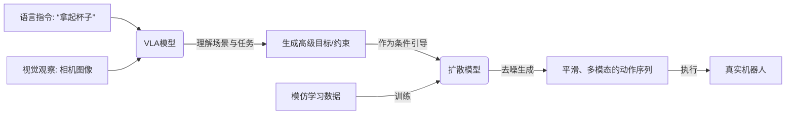

# 概念学习

## 世界模型

世界模型（World Model）是智能体对外部环境的内部表征，用于在脑中模拟环境状态的变化及行动的后果，从而在不直接与真实环境交互的情况下进行预测、推理与规划。它通常由感知编码、状态转移预测和状态解码组成，使智能体能够提前评估不同动作带来的结果，减少试错成本，并广泛应用于机器人控制、自动驾驶、数字孪生和基于想象的强化学习等领域。

## SLAM（似乎行业人员不推荐）

SLAM（Simultaneous Localization and Mapping，即同时定位与地图构建）是一种让机器人或无人系统在未知环境中，不依赖外部定位系统的情况下，利用传感器（如激光雷达、相机、IMU 等）实时估计自身位置并构建环境地图的技术。它的核心是同时解决定位与建图的“鸡生蛋”问题，通过前端特征提取与匹配获得相对位姿，再在后端融合优化以降低累计误差，从而实现自主导航、路径规划和环境感知等功能。

## VLN（VLA的一种）

VLN（Vision-and-Language Navigation，视觉与语言导航）是一种多模态智能体任务，旨在让机器人或虚拟代理在未知或半已知环境中，结合视觉感知和自然语言指令自主完成导航。它要求系统理解指令中的目标位置、路径描述和空间关系，并将其与摄像头等传感器获取的环境视觉信息对齐，生成连续的移动、转向等动作序列，最终准确到达指定位置。

## VLA

VLA（Vision-Language-Action，视觉-语言-行动）是一种多模态人工智能框架，旨在让智能体基于视觉感知和自然语言指令生成可执行的行动序列，不仅包括导航，还涵盖抓取、放置、操作设备等多种交互行为。它要求系统将视觉信息与语言语义深度融合，理解任务目标与操作步骤，并通过行动规划与执行模块在真实或模拟环境中完成由语言描述的复杂任务，体现更广泛的具身智能能力。

## PID算法

PID（Proportional–Integral–Derivative，比例-积分-微分）是一种常用的闭环反馈控制算法，通过对系统当前误差进行比例响应、累积误差积分修正以及误差变化率微分预测，将三部分加权求和得到控制量，从而实现系统快速、稳定地跟踪目标值，广泛应用于机器人运动控制、伺服驱动、温度调节等自动化领域。

## sim2real

在仿真环境中训练模型或算法，然后将其迁移部署到现实世界的机器人上。

## 扩散模型

好的，这是一个非常深入且重要的问题。我们来分步解析扩散模型，以及它如何与VLA和RL结合，成为当前具身智能领域最前沿的技术之一。

#### 第一部分：什么是扩散模型？

扩散模型是当前生成式人工智能领域的核心架构之一，它用于生成高质量的数据，如图片、音频、视频等。

##### 核心思想：循序渐进地去噪

想象一张被雾气（噪声）逐渐笼罩的清晰图片：

1.  **前向过程**：这是一个**破坏**过程。我们一步一步地向一张清晰的图片中添加噪声，经过很多步后，图片就变成了一团完全随机、没有任何信息的噪声。
2.  **反向过程**：这是一个**生成**过程。模型学习如何**逆转**上述过程。它从一团完全随机的噪声开始，一步一步地、逐渐地“去除噪声”，最终生成一张全新的、清晰的图片。

**关键在于**：模型在训练中学会了“如何根据当前有点模糊的图片，预测出下一步应该去掉哪些噪声，让它变得更清晰一点”。一旦模型掌握了这个“去噪”的本领，它就可以从纯粹的噪声中“幻想”出全新的、逼真的图像。

**打个比方**：就像一个雕塑家，他不是直接雕出一个完美的雕像，而是先有一块混沌的大理石（噪声），然后一步一步地凿掉不需要的部分（去噪），最终露出精美的雕像（生成的数据）。

---

#### 第二部分：扩散模型与VLA/RL的关系

扩散模型之所以能与VLA和RL结合，是因为它的一个关键优势：**它能生成非常平滑、多样且高质量的动作序列**。传统的RL策略可能会输出突兀或不稳定的动作，而扩散模型天生适合生成连续、连贯的数据。

它们之间的关系主要体现在 **“扩散策略”**  这个新兴的领域上。

##### 1. 扩散模型 + 模仿学习 → **Diffusion Policy**

这是最直接、最流行的结合方式。

*   **是什么**：**Diffusion Policy** 是一种**机器人行为克隆**的方法。它使用扩散模型来直接生成机器人的动作。
*   **如何工作**：
    1.  **输入**：当前的观察（如相机图像）和想要完成的任务（如“拿起杯子”）。
    2.  **过程**：扩散模型不是生成图片，而是生成一个**动作序列**（例如，机械臂未来几秒钟的每个关节角度）。
    3.  **输出**：模型通过“去噪”过程，从一个随机动作序列开始，逐步去噪，最终输出一个最优、最平滑、最可能成功的动作序列。
*   **为什么好**：
    *   **多模态性**：对于同一个场景，可能存在多种有效的动作（如从不同角度抓取杯子）。扩散模型能很好地捕捉和生成这种多模态的分布，而不是只给出一个“平均”的、可能无效的动作。
    *   **高精度与平滑性**：生成的动作非常平滑和精确，减少了机器人的抖动和不稳定行为。

**与VLA的关系**：VLA模型（如RT-2）可以将语言指令和视觉观察映射为一个抽象的“动作标记”。**Diffusion Policy可以成为VLA的“执行器”**。VLA负责高层理解和规划，输出一个高级目标，然后由Diffusion Policy来生成实现这个目标的、平滑可靠的低层关节控制指令。

##### 2. 扩散模型 + 强化学习 → **规划器或世界模型**

扩散模型也在开始赋能RL。

*   **作为规划器**：在基于模型的RL中，智能体需要预测未来的状态并规划最佳行动。扩散模型可以用于生成**多样化的、长期的未来状态或轨迹规划**，帮助智能体更好地探索和决策。
*   **作为世界模型**：世界模型的目标是模拟环境动力学，即预测给定动作后的下一个状态。扩散模型可以作为一个强大的**世界模型**，因为它能生成非常逼真和精确的未来状态图像，从而在仿真中进行更准确的预测和规划。

---

#### 总结与关系图

为了更清晰地理解，我们可以这样概括它们的关系：

| 技术         | 角色                       | 如何与扩散模型结合                                           |
| :----------- | :------------------------- | :----------------------------------------------------------- |
| **扩散模型** | ****强大的生成引擎**       | 核心是**去噪生成**，能产生高质量、平滑、多模态的数据（图片或**动作**）。 |
| **VLA**      | ****大脑**（感知与理解）** | 负责理解**语言指令**和**视觉场景**。它可以为扩散模型提供**生成目标**（如“生成一个拿杯子的动作”）。 |
| **RL**       | ****学习框架**             | 扩散模型可以作为一种**策略**，或者用于提升RL的**规划能力**和**世界模型**的逼真度。 |
| **模仿学习** | ****学习范式**             | **Diffusion Policy** 是直接应用，使用扩散模型作为策略，通过演示数据学习动作生成。 |

**关系流程图：**

**总而言之：**

扩散模型为机器人的**动作生成**带来了革命性的提升，使其动作更加**类人、平滑和可靠**。它与**VLA**结合，可以构建出“能思考、能执行”的具身智能体；它与**模仿学习**结合，催生了强大的**Diffusion Policy**；它也在为**强化学习**提供新的规划工具。

这三者的融合，正是目前让机器人变得更智能、更灵活的关键技术路径。

## ACT

ACT（Action Chunking Transformer）是一种机器人模仿学习算法，其核心思想是让机器人像人一样“走一步看几步”：它使用Transformer模型，不是一次只预测一个瞬时动作，而是直接输出未来一小段时间内的整个“动作块”（chunk），从而生成更平滑、更连贯、且能应对环境变化的运动轨迹，并且它非常高效，仅需少量人类演示数据就能学会复杂操作技能。

## post train

好的，一句话解释：

**Post-Train（后训练）指的是在大模型完成初始的“预训练”后，为了让其更好地适应特定任务或遵循人类指令，而进行的后续一系列训练技术的总称。**

---

为了让你更深入地理解，这里有一个详细的比喻和分解：

#### 一个比喻：培养一位天才学者

1.  **预训练：通识教育**
    *   让模型阅读海量的互联网文本（如书籍、文章、代码），学习语言的结构、语法、事实知识和逻辑推理能力。这时的模型是一个“博学但缺乏专精”的通才。

2.  **后训练：专业培养与品德教育**
    *   现在，我们需要这位通才学者成为一个有用的助手。后训练就是对他进行专门的培养：
    *   **有监督微调**：让他**学习高质量的问答对**（例如，“什么是光合作用？” -> “光合作用是...”）。这教会他如何以“问答”的形式与人交流，而不仅仅是续写文本。
    *   **奖励模型训练**：让人类标注员对不同的答案进行排序（例如，答案A比答案B更好）。这相当于教会他**辨别“好答案”和“坏答案”的品味**。
    *   **强化学习**：基于上一步的“品味”，使用强化学习算法（如PPO）进一步优化模型，让它**倾向于生成人类更偏好的、更安全、更有帮助的回答**。这相当于通过不断的实践和反馈，固化他的良好行为。

所以，**后训练就是一个“精雕细琢”的过程**，目的是将一个大模型从一个“原始的通才”转变为“听话且有用的专才”。

#### 为什么Post-Train如此重要？

*   **对齐**：让模型的行为与**人类的意图、价值观和偏好**保持一致（Alignment）。没有后训练的模型可能会生成有害、偏见或无用的内容。
*   **提升能力**：显著提升模型在**特定任务**（如对话、编程、创作）上的表现，激发其在预训练中学到但未展现的能力。
*   **可控性**：使模型能够更好地**遵循复杂的指令**。

#### 在您之前看到的VLA/机器人招聘要求中...

当招聘要求里提到“具备大模型Post Training算法方案和数据构造经验”时，他们是在寻找这样的专家：

*   能够设计流程，用**机器人演示数据**（如视频、动作序列）对预训练好的VLA模型进行微调。
*   能构建**奖励模型**来判断哪个机器人的动作序列更好、更高效、更安全。
*   能使用**强化学习**来优化模型，使其生成的机器人动作越来越符合人类的期望。

总结来说，**Post-Train是打造实用化、高性能、安全可靠的大模型（包括VLA模型）不可或缺的关键步骤。**

## Manipulation/Locomotion

在机器人学中，**Manipulation（操作）** 和 **Locomotion（移动）** 是两个核心概念，分别代表了机器人与环境交互的两种基本方式。简单来说，**Manipulation 关注的是如何通过机器人的“上肢”（如机械臂和灵巧手）去操控和改变外部物体或环境的状态**，例如抓取、装配或焊接物体。而 **Locomotion 则关注的是如何通过机器人的“下肢”（如轮子、腿足）实现机器人自身在空间中的移动**，例如行走、跑步和导航。两者的根本区别在于，操作的核心目标是影响外部物体，而移动的核心目标是改变机器人自身的位置。在现代机器人，尤其是人形机器人中，这两者正日益深度融合，以实现更复杂的“移动操作”任务，如一边行走一边搬运物品。

## 强化学习的Model-based/Model-free

Model-based（基于模型）方法的核心特点是智能体需要学习或利用一个已知的环境模型，这个模型能够预测在特定状态下执行某个动作后，环境会转移到什么新状态以及会得到什么奖励；智能体利用这个模型进行内部模拟和规划，从而在较少与真实环境交互的情况下就能做出高效决策，但其性能高度依赖于模型准确性。
相比之下，Model-free（无模型）方法则完全放弃构建环境模型，智能体不关心环境如何运作，而是直接通过与环境进行大量试错交互，根据获得的奖励信号来学习最优策略或评估动作的价值，这种方法更适用于环境复杂难以建模的场景，但通常需要更多的交互数据。两者的根本区别在于是否依赖对环境动态（状态转移和奖励）的显式建模来进行决策，这导致了它们在数据效率、计算复杂度和适用场景上的不同权衡。